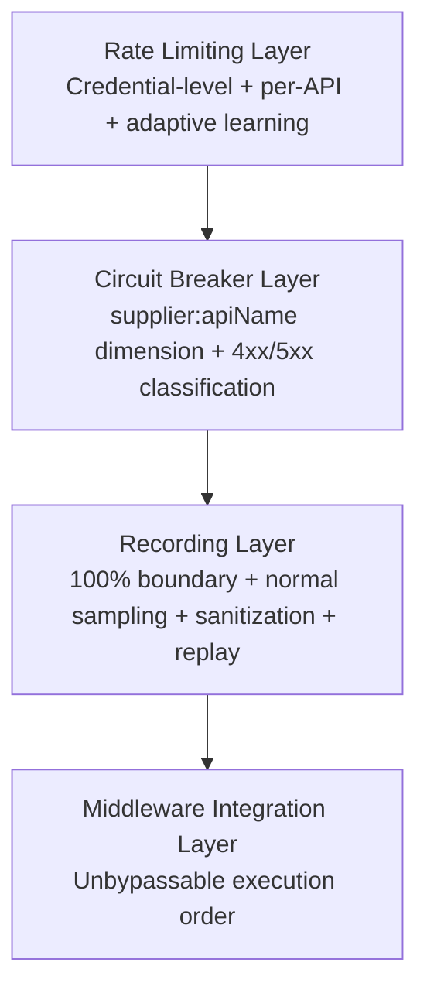
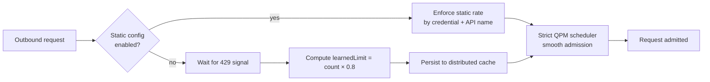
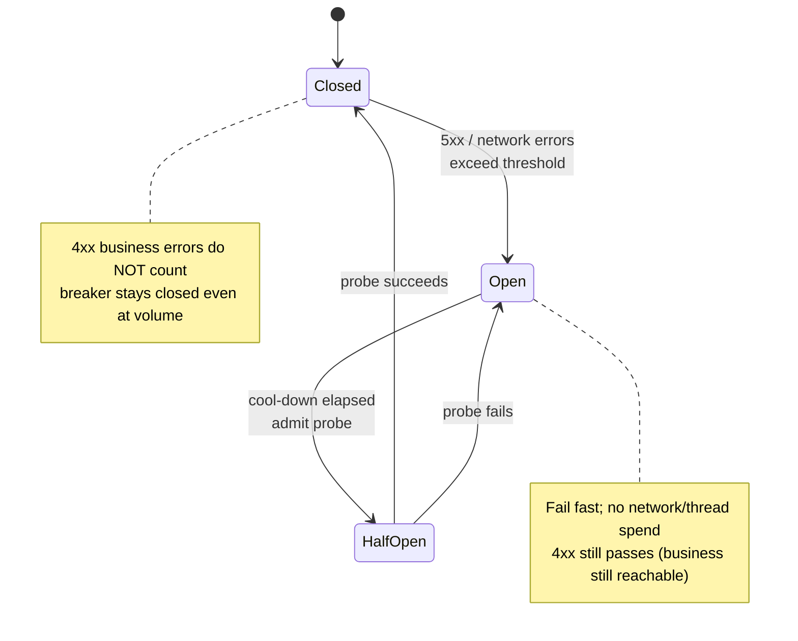

<div class="whitepaper-reader-note">
  <strong>Reading path:</strong> this is the full WP07 whitepaper. For a shorter reader-facing guide, start with <a href="/en/whitepapers/wp07-supplier-resilience/">the blog guide</a>. Browse the series at <a href="/en/whitepapers/">HotelByte Whitepapers</a>.
</div>

# Supplier Resilience Engineering

**Document Version:** 2.0  
**Classification:** External — Technical Whitepaper  
**Scope:** HotelByte Supplier Integration Platform

---

## Executive Summary

**Assumed audience:** platform engineers, enterprise architects, integration owners, SREs, and technical reviewers evaluating governed supplier integration capabilities in hotel distribution.

**TL;DR:** True supplier resilience is not adding more retries—it is routing classification, rate limiting, circuit breaking, recording, replay, and audit into a single governed request chain.

> **Central claim:** Supplier resilience starts with failure classification before retry policy.

Picture a small hiccup on a cancellation API: the search API stays perfectly healthy, yet both endpoints are blocked by the same circuit breaker. A business 4xx—"no rooms for that date"—inflates the failure budget designed for 5xx. An HTTP 429 rate-limit signal gets drowned under automatic retries and pushes the supplier's capacity past the edge. None of this happens because there are not enough retries. It happens because retries run before classification.

HotelByte operates a global hotel API distribution platform that aggregates inventory from 27+ heterogeneous supplier APIs. These suppliers exhibit wide variance in reliability, latency characteristics, rate-limiting policies, and failure modes. A single supplier degradation can cascade into platform-wide instability without engineered containment boundaries.

This whitepaper describes the Supplier Resilience Engineering layer built into the HotelByte platform—a multi-layered control system that isolates supplier failures, adapts to runtime conditions, and preserves customer-facing availability even when upstream dependencies are under stress. The system combines adaptive rate limiting, per-supplier circuit breakers, traffic recording and replay capabilities, and unified middleware instrumentation into a cohesive defense architecture. The result is a platform where supplier outages are contained, rate-limit violations are prevented rather than reacted to, and operational teams have full observability into every resilience decision.

---

## Problem Definition

Supplier Resilience Engineering is not a stand-alone feature. In a hotel distribution platform, supplier integration typically connects supplier variance, customer experience, platform stability, business rules, and external audit requirements all at once. Without explicit boundaries, a local implementation will leak risk into search, booking, payment, customer support, and data operations.

For that reason, HotelByte does not treat Supplier Resilience Engineering as "writing some business code." It treats it as an engineering control plane. The control plane must answer four questions:

- What real operational risk does this capability remove?
- What facts, state, or fields support the judgment?
- What actions have explicit boundaries and cannot be left to implicit convention?
- How is a "done" claim proven by tests, logs, audit, or replay evidence?

Only when all four have answers is the capability ready for enterprise delivery and external technical review.

---

## Scope

This document covers the technical controls that govern outbound supplier traffic within the HotelByte platform:

- **Rate limiting and traffic shaping** for supplier API credentials—static configuration, adaptive learning, and strict QPM scheduling
- **Circuit breaker isolation** per `supplier:apiName` endpoint—failure-budget management
- **Traffic recording and replay**—100% boundary capture, normal-traffic sampling, sensitive-field sanitization, replay validation
- **Middleware integration** that unifies resilience controls across the request lifecycle
- **Observability and auditability** of every resilience decision

This whitepaper does not cover general platform infrastructure resilience (e.g., compute autoscaling, database replication) or customer-facing API rate limiting, which are addressed in separate documents.

---

## Objectives

The Supplier Resilience Engineering program is designed to achieve the following operational objectives:

1. **Isolation:** Prevent failure in one supplier integration from affecting traffic to other suppliers or degrading the overall platform.
2. **Adaptation:** Automatically adjust traffic rates in response to supplier feedback (HTTP 429, latency spikes) without manual intervention.
3. **Prevention:** Stop requests from reaching suppliers that are already exhibiting failure symptoms, reducing wasted capacity and improving response times.
4. **Observability:** Record every resilience decision and supplier interaction with sufficient fidelity to support post-incident analysis and compliance verification.
5. **Recoverability:** Enable deterministic replay of supplier interactions to validate fixes and reproduce issues without live traffic exposure.

---

## Design Principles

The resilience layer is built on five core design principles, each anchored in a concrete failure narrative:

### Fail Fast and Recover Gracefully

> "Holding requests in slow queues is worse than refusing to serve them at all."

When a supplier is experiencing degradation, the platform detects the condition quickly and returns a controlled response rather than holding requests in long queues or retry loops. This preserves downstream capacity and improves perceived responsiveness. Recovery is gradual and evidence-based: a supplier is not re-admitted to full traffic until it demonstrates sustained health.

### Learning from Feedback

> "HTTP 429 is not an error. It is the supplier telling you its current capacity ceiling."

Suppliers communicate their operational state through response codes, latency distributions, and rate-limit headers. The platform treats this feedback as a control signal rather than an error condition. HTTP 429 responses are used to compute a safe operating threshold that is persisted and applied to future traffic automatically—no manual tuning required.

### Defense in Depth

> "No single control is sufficient across 27+ heterogeneous suppliers."

Rate limiting prevents overload; circuit breakers isolate failures; traffic recording provides forensic capability; middleware instrumentation ensures consistent application across all integration paths. Each layer is independently replaceable and testable.

### Interface-First Design

> "Resilience components must be replaceable. The supplier can change; the platform must not."

All resilience components are defined by interfaces (e.g., `BoundaryDetector`, `SamplingStrategy`, `RecordingStore`) rather than concrete implementations. This allows components to be extended, replaced, or mocked for testing without changing the consuming code.

### Dimension Isolation

> "A search-API failure must not eat the cancellation-API failure budget."

Controls are scoped to the finest practical dimension. Rate limits operate at the credential level and can be further scoped by API name. Circuit breakers are isolated per `supplier:apiName` pair. This prevents a single misbehaving endpoint from consuming the failure budget of an entire supplier or credential.

---

## Layered Architecture

The resilience layer is organized into four functional layers, each addressing a distinct class of risk. **Omitting any layer passes its risk to the next**—each subsection below closes with a counterfactual showing what fails without it.



Together, the four layers form a single working chain: input is normalized, key state is constrained, risk is intercepted at control points, output carries auditable context, and the result is provable through tests, replay, or runtime metrics.

### Rate Limiting Layer



> **Without it:** the supplier will use its own HTTP 429 to take us down.

The rate limiting layer enforces controlled traffic flow to supplier APIs through a dual-engine architecture that can be selected via feature flag.

The **config-driven engine** applies static rate limits defined per API credential. Limits can be specified globally or scoped to individual API names (`byApi`), letting you throttle high-cost operations (cancellation, booking) more aggressively than lightweight queries.

The **adaptive learning engine** responds to runtime feedback. When an HTTP 429 is detected, the system calculates a safe threshold from the recent request window (`learnedLimit = count × 0.8`) and persists this value to a distributed cache. Subsequent traffic is throttled to this learned limit until the supplier demonstrates capacity to absorb more load. This eliminates the need for manual limit tuning when supplier quotas change.

A **strict QPM scheduler** provides smooth request queuing rather than bursty admission, ensuring that rate limits are respected continuously rather than at interval boundaries.

All rate-limiting decisions emit timing metrics (`SupplierRateLimitWaitTiming`) for operational visibility.

### Circuit Breaker Layer



> **Without it:** a single bad endpoint takes down the supplier's search and booking experience.

Circuit breakers provide failure-state isolation at the `supplier:apiName` dimension. Each isolated breaker monitors its own failure rate independently.

The breaker distinguishes between **transient infrastructure failures** and **business-level errors**. Network timeouts, connection failures, and HTTP 5xx responses count toward the failure threshold and can trigger breaker opening. HTTP 4xx business errors (e.g., invalid destination code, room unavailable) are treated as expected application outcomes and do not contribute to breaker state.

When a breaker opens, requests to that supplier endpoint are rejected immediately without consuming network resources or adding latency. The breaker periodically allows a probe request through to test recovery. Once the supplier demonstrates success, the breaker closes and normal traffic resumes.

All breaker rejections are counted by the `SupplierCircuitBreakerRejected` metric for alerting and capacity planning.

### Recording Layer

> **Without it:** incident postmortems have to rely on oral history.

The traffic recording layer captures supplier interactions for post-incident analysis, compliance evidence, and regression testing.

A **boundary detector** classifies requests into boundary-triggered (HTTP 400+, timeouts, rate-limit headers) or normal traffic based on configurable rules.

A **sampling strategy** ensures high-value traffic is retained: boundary-triggered requests are recorded at 100%, while normal traffic is sampled proportionally. This optimizes storage without losing incident-critical data.

A **sanitizer** applies static regex-based desensitization to remove sensitive data (credit card numbers, email addresses, authentication tokens) before storage, ensuring that recorded traffic does not create a compliance liability.

Recorded data is stored in the existing operational log infrastructure, reusing established retention, backup, and access-control policies.

A **replay system** supports three query patterns: find by request signature, find by boundary type, and list by time range. The **replay player** executes stored requests against the current supplier implementation and reports success, duration, and error state, enabling deterministic validation of fixes and supplier behavior changes.

### Middleware Integration Layer

> **Without it:** an adapter will quietly bypass every control with a raw HTTP client.

All resilience controls are applied through a unified middleware chain that executes consistently for every supplier request:

```
cache → rate limit → circuit breaker → proxy → HTTP → error mapping → write cache
```

This ordering is deliberate: cache lookups bypass all downstream controls for efficiency; rate limiting is applied before circuit breaker evaluation so that queued requests are not prematurely rejected; the circuit breaker protects the actual HTTP transport; error mapping translates supplier-specific responses into platform-standard outcomes; and cache writes populate the result cache for subsequent identical requests.

```mermaid
flowchart LR
    CACHE["Cache lookup<br/>(hit skips downstream)"] --> RL["Rate limit<br/>(consume credential budget)"]
    RL --> CB["Circuit breaker<br/>(fail fast if open)"]
    CB --> PROXY["Proxy"]
    PROXY --> HTTP["HTTP transport"]
    HTTP --> EM["Error mapping<br/>(after response)"]
    EM --> WRITE["Cache write<br/">(success + non-empty only)"]
```

Request and response logging middleware captures structured logs for every interaction. An `OnError` hook ensures that error paths are logged with the same fidelity as success paths. All logs are automatically populated with standardized correlation identifiers, and credential information is desensitized before emission.

---

## Implemented Control Summary

| Control | Customer Value |
|---|---|
| **Adaptive Rate Limiting** | Prevents supplier quota exhaustion and HTTP 429 rejections by automatically learning and enforcing safe traffic thresholds. Ensures consistent API availability for hotel search and booking operations. |
| **Credential-Level Rate Limits** | Isolates traffic by API credential and API name, preventing one customer or integration pattern from consuming another's capacity. |
| **Per-Supplier Circuit Breakers** | Contains supplier outages and degradations so that a single failing supplier does not slow down or fail entire search or booking requests. Customers receive faster fallback responses. |
| **4xx vs. 5xx Failure Classification** | Distinguishes business-level unavailability (e.g., no rooms) from infrastructure failure. Circuit breakers do not trip on business errors, ensuring legitimate searches are not blocked. |
| **Traffic Recording & Sampling** | Enables HotelByte to investigate supplier issues with full request/response fidelity. Customers benefit from faster root-cause analysis and resolution times. |
| **Data Sanitization** | Removes PII and credentials from recorded traffic. Customers' sensitive data is never persisted in operational logs or replay stores. |
| **Traffic Replay** | Allows supplier behavior changes and fixes to be validated against historical traffic without live exposure. Customers receive higher-quality integrations as regressions are caught pre-deployment. |
| **Unified Middleware Chain** | Guarantees that every supplier request passes through the same resilience controls in the same order. Customers experience consistent reliability regardless of which supplier serves their request. |
| **Structured Observability** | All resilience decisions emit metrics and structured logs. Customers benefit from transparent SLI/SLO reporting and incident communication grounded in data. |

---

## Auditability

The resilience layer is designed for continuous verification through the following mechanisms:

### Metrics

Every control emits operational metrics that are consumed by dashboards and alerting systems:

- `SupplierRateLimitWaitTiming` — latency introduced by rate-limit queuing, per supplier and API
- `SupplierCircuitBreakerRejected` — count of requests rejected by open circuit breakers, per supplier and API

These metrics enable SRE teams to verify that controls are active and quantify their impact on traffic flow.

### Structured Logging

All supplier interactions are logged with consistent structure via structured audit records. Logs include request identifiers, supplier names, API names, response status, duration, and resilience control outcomes. Credential data is desensitized before logging to prevent credential leakage in log stores.

### Traffic Recording

The recording layer provides an independent audit trail of supplier interactions. Recorded traffic can be queried by time range, request signature, or boundary type to reconstruct incident timelines or verify control behavior.

### Replay Validation

The replay system enables deterministic re-execution of historical requests against current supplier implementations. This supports:

- **Regression testing** after supplier-side changes or platform updates
- **Control verification** by replaying traffic that previously triggered rate limits or breakers
- **Compliance evidence** by demonstrating that recorded requests produce expected outcomes

### Feature Flag Governance

The dual-engine rate limiter and other configurable behaviors are controlled by feature flags. Changes to resilience behavior can be rolled out gradually, audited per flag state, and reverted without deployment.

---

## Comparison with Traditional Approaches

| Traditional Approach | Risk | HotelByte Approach |
|---|---|---|
| Treat all failures as "retry problems" and add exponential backoff | 4xx business errors get retried endlessly; 5xx budgets get inflated by business noise; HTTP 429 floods the supplier and breaks capacity | Force four failure categories into four control paths; classify, then decide |
| Mount circuit breakers at the supplier level | One misbehaving endpoint (e.g., cancellation) drags down search and booking for the whole supplier | Circuit breakers are isolated at `supplier:apiName`; one endpoint cannot contaminate the others |
| Hand-tune limits every time a supplier changes quota | Tuning lags reality; emergency deploys queue up; no adaptive response | The adaptive learning engine auto-computes thresholds from 429 signals and persists them |
| Skip recording or sample too coarsely; rely on war-room memory to reconstruct incidents | Root cause is unprovable; regressions slip through; compliance has no evidence | 100% boundary recording + sampled normal traffic + sanitization + replay validation |
| Allow raw HTTP clients that bypass the middleware chain | Controls are silently bypassed; operations cannot guarantee behavior | Raw HTTP clients are architecturally prohibited; the unified executor enforces order |

---

## Authoritative Source References

| Source | Original Excerpt | HotelByte Control Mapping |
|---|---|---|
| **Netflix Hystrix** — Circuit Breaker Pattern | "When we began using Hystrix, we found that it forced us to confront the reality of failures in our distributed system and build resilience patterns around them." | HotelByte implements per-supplier circuit breakers using the same fault-isolation philosophy, scoped to `supplier:apiName` dimensions to contain failures without cross-contamination. |
| **Google SRE Book** — Chapter 22: Addressing Cascading Failures | "Serving traffic very slowly is worse than refusing to serve it at all... Shed load as close to the beginning of the request path as possible." | The middleware chain places rate limiting and circuit breakers before the HTTP transport, ensuring degraded suppliers are rejected early rather than consuming resources in slow queues. |
| **Google SRE Book** — Error Budgets | "Error budgets protect customers from repeated SLO violations and cover the product team from over-prioritizing reliability work." | Per-supplier circuit breakers act as automatic error-budget enforcers: once a supplier exceeds its acceptable failure rate, traffic is shed until it recovers. |
| **OWASP API Security Top 10 (2023)** — API4:2023 Unrestricted Resource Consumption | "APIs do not always impose restrictions on the size or number of resources that can be requested by the client/user... The lack of, or misconfigured, rate limiting can allow attackers to perform Denial of Service (DoS) attacks." | HotelByte's credential-level and adaptive rate limiting directly addresses this risk by enforcing consumption boundaries on all outbound supplier traffic. |
| **OWASP API Security Top 10 (2023)** — API10:2023 Unsafe Consumption of APIs | "Developers tend to trust data received from third-party APIs... Attackers can identify third-party service providers and try to compromise them to compromise the target API." | Traffic recording with sanitization and circuit breaker isolation limits exposure to compromised or misbehaving supplier endpoints by detecting anomalies and preventing sensitive data leakage. |
| **OWASP Cheat Sheet Series** — Logging | "Log entries should include timestamps, user context, event descriptions, and outcomes... Sensitive data should never be logged." | HotelByte's structured audit logging includes all required fields, and credential desensitization ensures that secrets are not persisted in logs or replay stores. |
| **Martin Fowler** — Circuit Breaker Pattern | "The basic idea behind the circuit breaker is very simple. You wrap a protected function call in a circuit breaker object, which monitors for failures. Once the failures reach a certain threshold, the circuit breaker trips." | HotelByte circuit breakers follow this exact pattern, with the addition of 4xx/5xx classification to avoid tripping on expected business errors. |
| **AWS Well-Architected Framework** — Reliability Pillar | "Control and limit retry calls to prevent additional load on an already stressed system. Use jittered exponential backoff to space out retry attempts." | HotelByte's strict QPM scheduler and adaptive rate limiting provide equivalent load-spreading behavior, with the added benefit of automatic threshold learning. |

## Technical Whitepaper Governance Reading

Read Supplier Resilience Engineering through the technical whitepaper governance loop: intent, evidence, bounded execution, verification, and durable governance.

| Plane | What to inspect in this paper |
|---|---|
| Intent | Which operational or integration risk the design removes. |
| Evidence | Which logs, metrics, records, traces, tests, or replay artifacts prove the behavior. |
| Execution boundary | Which layer owns the decision and which layer only adapts or transports data. |
| Verification | Which failure modes are tested beyond the happy path. |
| Governance memory | Which rules, dashboards, audit trails, or test cases make the lesson reusable. |

## Conclusion

Supplier Resilience Engineering matters because it turns a fragile implementation concern into a governed platform capability. The durable value is not that the component exists, but that its boundaries, evidence, failure semantics, and verification path can be reviewed after the fact.

Supplier resilience starts with failure classification before retry policy.