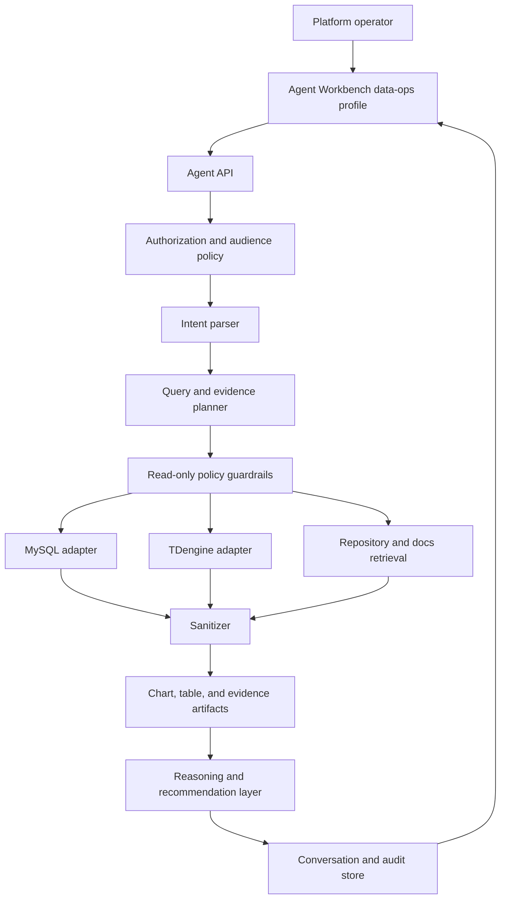

  <strong>Reading path:</strong> this is the full whitepaper. For a shorter reader-facing guide, start with <a href="/en/whitepapers/wp26-data-agent-operational-intelligence/">the blog guide</a>. Browse the full series at <a href="/en/whitepapers/">HotelByte Whitepapers</a>.

# Governed Data Agent for Operational Intelligence Whitepaper

## Executive Summary

HotelByte's Data Agent provides a governed conversational analytics layer for platform operations. It helps operators investigate questions that span operational MySQL data, TDengine telemetry, and repository-defined business logic while preserving strict permission, masking, visualization, and audit controls.

The key design choice is to treat the agent as an evidence assembly system rather than a raw SQL console. Natural-language prompts are converted into bounded query intent, source-specific read plans, repository evidence, masked result artifacts, and human-confirmable recommendations. This enables faster incident triage and data reconciliation without bypassing established operational controls.

The first implementation slice is intentionally narrow and verifiable: platform-only users can ask supplier reliability questions; the backend executes a bounded TDengine `hb_log` aggregation, attempts the MySQL supplier snapshot read model, attaches repository evidence, masks supplier identifiers, and returns typed artifacts for the UI. Unsupported or unavailable sources are reported as evidence gaps.

## Scope

This whitepaper covers the architecture, controls, and verification model for the Data Agent capability:

- Natural-language investigation across operational data and telemetry.
- MySQL and TDengine read adapters with policy enforcement.
- Repository and documentation evidence retrieval.
- Sensitive-data masking before reasoning and rendering.
- Multi-turn conversation state.
- Visual and tabular result artifacts.
- Auditability of prompts, query plans, evidence, and recommendations.

The intended audience is enterprise technical decision makers, data leaders, platform operations teams, and security reviewers.

## Objectives

1. **Operational Velocity**: Reduce time from question to evidence-backed explanation during data-ops and incident investigations.
2. **Cross-System Reasoning**: Join durable business state, time-series logs, and code-defined business rules in one workflow.
3. **Governed Access**: Ensure platform-only visibility, backend authorization, source allowlists, and deterministic masking.
4. **Decision Quality**: Render charts, structured tables, and evidence references instead of prose-only answers.
5. **Auditability**: Preserve a reviewable trail from prompt to query plan, result artifact, and recommendation.

## Design Principles

### Evidence Before Narrative

Every answer is grounded in data and implementation evidence. The agent is expected to return query intent, source references, and repository or documentation context before producing interpretation or recommendations.

### Read-Only by Default

The Data Agent is designed for investigation, not mutation. SQL and telemetry access are constrained to read-only adapters, schema allowlists, row limits, and bounded time windows. Operational actions remain human-confirmed drafts.

### Masking as Code

Sensitive data is not protected by prompt instructions alone. Credentials, tokens, PII, commercial fields, order identifiers, trace identifiers, and supplier account details are masked by deterministic sanitizer code before they reach model context or browser rendering.

### Visualization as a First-Class Artifact

Operational answers must be scannable. The agent emits typed chart and table artifacts so operators can compare trend, volume, confidence, and redaction impact before taking action.

### Repository-Aware Interpretation

Hotel operations data often derives its meaning from code: state transitions, supplier fallback rules, mapping logic, credential policy, and integration-specific behavior. The Data Agent includes repository and documentation retrieval to prevent correct metrics from being interpreted with the wrong business rule.

## Architecture

### Intent Parser

The parser transforms a natural-language question into structured intent:

- selected sources,
- time window,
- supplier/order/trace/session filters,
- requested output types,
- expected aggregation or reconciliation shape,
- safety requirements.

### Query and Evidence Planner

The planner produces bounded read plans rather than arbitrary SQL strings. Plans declare the source adapter, allowed schemas, selected columns, joins, filters, grouping, row limits, and sanitizer requirements. SQL or TDengine statements are generated from these plans only after policy validation.

### Source Adapters

The MySQL adapter reads durable operational entities such as orders, suppliers, credentials, mappings, wallets, and configuration. The TDengine adapter reads request and log telemetry with required time bounds and aggregation-first query shapes. The repository adapter retrieves code and documentation evidence in bounded chunks with source references.

Current verified behavior:

- TDengine UAT read path returned real `hb_log` rows for the last-day hotelRates/rateCount aggregation on May 17, 2026.
- MySQL source inventory showed a deployment split: one checked UAT DB had stale `inventory_quality_daily_supplier_snapshot` rows dated only `2026-04-25`, while the checked Prod DB had neither `inventory_quality_daily_supplier_snapshot` nor `supplier_daily_snapshot`.
- The implemented MySQL read path probes a deterministic candidate catalog at runtime: repo-owned `supplier_daily_snapshot` first, then legacy `inventory_quality_daily_supplier_snapshot`. Missing, undeployed, or stale windows are reported as gaps rather than source-of-truth rows.
- The frontend renders only returned `data_ops_result` artifacts; it does not render static sample result rows.

### Sanitizer and Artifact Builder

Raw source output is normalized into typed frames, sanitized, and then assembled into artifacts:

- chart series,
- masked result tables,
- evidence references,
- SQL intent summaries,
- recommendation drafts.

The model explains artifacts; it does not own the artifact schema.

### LLM Operating Model

The LLM is downstream of retrieval and policy. It receives a governed evidence package: intent, bounded query plan, masked rows, repository references, and source gaps. It is not allowed to execute arbitrary SQL directly or decide whether a secret can be shown. The model can interpret the artifact, ask for a narrower follow-up scope, and draft recommendations for human review.

### Knowledge Catalog

The agent knows where to look through a maintained source catalog that maps question families to data sources, schemas, dimensions, metrics, and repository anchors. For example, hotelRates supplier reliability maps first to TDengine `hblog_ns.hb_log` for live facts, then to MySQL read-model candidates only when runtime schema and freshness probes pass. This is deterministic adapter routing, not LLM table inference. The catalog must be updated alongside migrations and business-rule changes.

## Implemented Control Summary

| Control | Customer Value |
|---|---|
| **Platform-only agent surface** | Limits broad operational analysis to authorized platform users. |
| **Backend authorization boundary** | Prevents UI visibility from becoming the final security decision. |
| **Read-only query planning** | Reduces risk of accidental production mutation from generated SQL. |
| **Source and schema allowlists** | Keeps investigations inside approved operational data domains. |
| **Default sensitive-data masking** | Protects credentials, tokens, PII, commercial fields, and operational identifiers. |
| **Repository evidence references** | Grounds explanations in the business logic that actually runs the platform. |
| **Typed visual and table artifacts** | Enables deterministic rendering and review before follow-up action. |
| **Multi-turn context retention** | Lets operators refine time windows, suppliers, and traces without losing evidence. |
| **Human-confirmed recommendations** | Keeps operational judgment with the operator, not the model. |
| **Audit trail for prompts, plans, and artifacts** | Supports incident review, compliance checks, and model-output accountability. |

## Auditability

Every investigation should be reconstructable:

- who asked the question,
- which profile and audience were used,
- what scope and sources were selected,
- which permission decisions were made,
- what query plan was generated,
- which source adapters executed,
- what sanitizer classes were applied,
- which evidence references were retrieved,
- which artifacts were rendered,
- what recommendations were produced,
- what the operator confirmed or rejected.

Audit records must avoid storing raw secrets or unmasked sensitive values.

## Safety and Failure Behavior

The Data Agent fails closed:

- Missing or ambiguous permission results in denial.
- Unsafe SQL is rejected before execution.
- Unclassified sensitive columns are suppressed or masked.
- Unbounded time-series queries are rejected.
- Repository retrieval failures are reported as evidence gaps, not filled with guesses.
- Recommendations remain drafts until a human confirms an operational action.

## Verification Model

External reviewers can evaluate the capability through:

- route and audience checks,
- profile availability checks,
- generated query plan inspection,
- read-only adapter tests,
- schema allowlist tests,
- sanitizer test vectors,
- chart/table artifact schema validation,
- audit log completeness checks,
- non-platform denial tests.

## Differentiation

Traditional dashboards are fast for known questions but weak for new operational investigations. Raw SQL consoles are flexible but expose too much risk. General chatbots can summarize but usually lack data permissions, masking, and implementation evidence.

The Data Agent combines these surfaces: dashboard-like visualization, SQL-like flexibility, repository-aware explanation, and governance controls designed for production operations.

## Authoritative Source References

| Reference Area | HotelByte Control Mapping |
|---|---|
| OWASP guidance for LLM application security | Prompt input, generated output, and tool execution are constrained by policy checks, structured artifacts, and deterministic sanitization. |
| NIST AI Risk Management Framework | The design emphasizes governance, traceability, human oversight, and measurable risk controls around AI-assisted decisions. |
| ISO/IEC 42001 AI management systems | Audit records, performance evidence, and decision traceability support AI management review. |
| Database least-privilege practice | Read-only credentials, schema allowlists, bounded queries, and DML rejection reduce blast radius. |
| Data minimization practice | The sanitizer and artifact builder expose only the fields needed for the operational question. |

