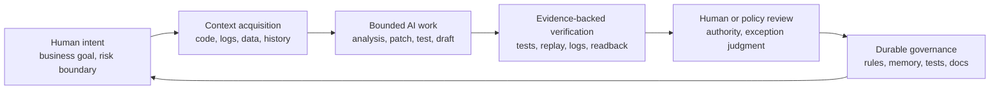
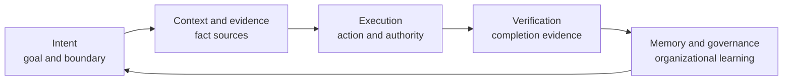
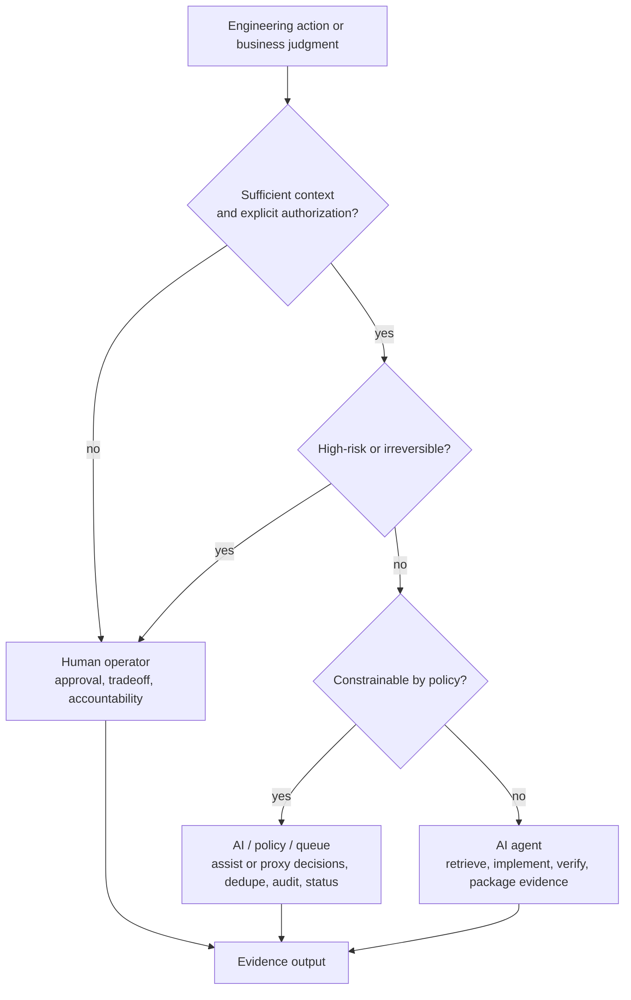
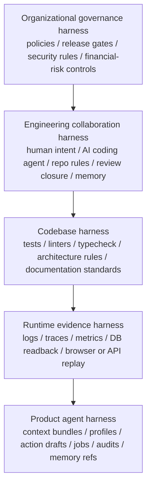
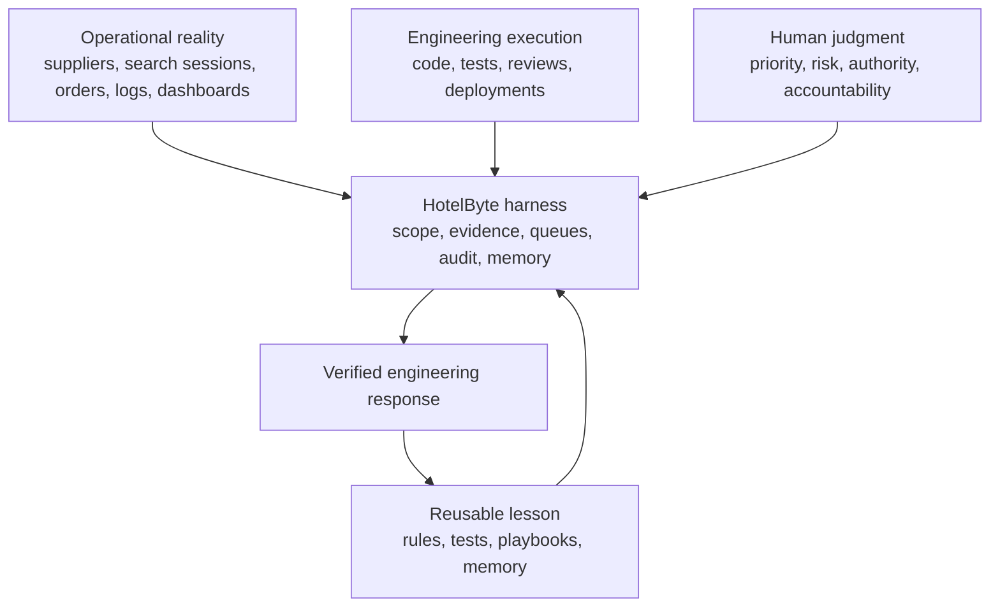
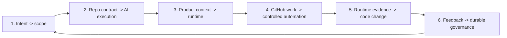

## Executive Summary

**Assumed audience:** engineering leaders, staff engineers, platform engineers, and AI tooling builders who already understand modern software delivery and want to make AI participation governable.

**TL;DR:** By 2026, AI is no longer just a coding convenience. It already participates in issue triage, code changes, pull-request review, test repair, incident analysis, data investigation, and release preparation. The missing layer is not more model output; it is a governed operating system that connects human judgment, AI execution, runtime evidence, review, memory, and release control into one verified feedback loop. HotelByte is the case study.

Software engineering has crossed the threshold where AI is merely an assistant at the edge of the workflow. In modern teams, AI can inspect repositories, draft patches, summarize logs, prepare review responses, write tests, and operate inside issue queues. The hard question has moved from "Can the model help?" to "Can the organization safely absorb AI work without losing context, authority, or operational truth?"

An AI-native engineering organization does not ask, "Which model should write this function?" It asks, "How do intent, context, code, runtime evidence, review, deployment, memory, and accountability flow between humans and AI agents without losing control?"

This whitepaper proposes the **AI-Native Engineering Operating System**: a socio-technical architecture for building, operating, and evolving software with human operators and AI agents as explicit participants. Its center of gravity is not model autonomy. Its center of gravity is **governed agency**: every AI action must be grounded in context, bounded by authority, verified by evidence, and folded back into organizational learning.

In this system, humans own intent, judgment, authority, and accountability. AI agents own high-throughput discovery, implementation, verification, synthesis, and routine closure. The operating system between them is the harness: project rules, evidence contracts, role routing, memory, queues, review gates, runtime validation, and audit trails.

HotelByte shows what this looks like in a production-facing engineering organization. The interesting part is not that the team added AI to a backend system. The interesting part is that AI work was pulled into the same control surface as code review, incident response, runtime evidence, release discipline, and organizational memory.

> **Central claim:** The next durable engineering advantage will not come from letting AI write more code in isolation. It will come from building an operating system where AI work is scoped by human intent, grounded in live evidence, checked by review and policy, and converted into organizational learning.

---

## From Output Growth to a Governed Loop

This section defines the problem first, then states the operating principle. AI-native engineering is not the act of attaching a model to an editor. It is the act of placing AI output inside a traceable, verifiable, and governable feedback system.

### Problem Definition: AI Output Is Not Engineering Capability

The first mistake organizations make after adding AI to engineering is treating more output as stronger system capability. More code, faster replies, and longer analysis do not automatically make delivery more reliable.

Output-centric AI optimizes local production while leaving the delivery system unchanged. Typical failure modes include:

- **Prompt-local success**: the answer looks correct but is not grounded in the current codebase or runtime.
- **Context evaporation**: decisions made in chat do not become durable repo rules, tests, or operational memory.
- **Review displacement**: AI produces more code than the organization can review or verify.
- **Automation without authority**: agents perform actions without clear human or policy approval.
- **Memory without governance**: prior experience is reused without freshness checks or source accountability.
- **No organizational learning**: repeated human corrections do not change future AI behavior.

These are not model-quality problems alone. They are engineering operating-system problems. The objective is not to make AI write slightly more work; it is to make AI work traceable, verifiable, and governable.

---

### Core Principle: The Verified Feedback Loop

The fundamental unit of AI-native engineering is not the prompt, the model, or the agent. It is the **verified feedback loop**.

Put more sharply: **AI becomes an engineering asset only when its work can be traced from human intent to evidence-backed completion and then back into durable governance.**



AI becomes reliable when this loop is explicit, observable, and governed. Without that loop, AI remains an assistant. With it, AI becomes part of the engineering operating system.

---

## Operating Model and Authority Boundaries

After the loop principle, the next task is making it executable for an organization: split the system into governed planes, define who may decide under which conditions, and route AI work through the engineering control surface.

### Five Governed Planes

The operating model turns the principle into an executable structure. The five planes form one work chain: set the goal, gather the facts, bound the action, prove the result, and retain the lesson.



| Plane | Question it answers | What it carries | Failure it prevents |
|---|---|---|---|
| Intent | What does the human actually want, and what should not be done? | Business outcomes, risk tolerance, acceptance criteria, deadlines, non-goals, decision boundaries, issues, review threads, spec proposals, and explicit corrections. | AI reducing a strategic objective into a convenient but wrong local patch. |
| Context and evidence | Where are the facts needed for judgment, and can they be reviewed? | Code references, test output, runtime logs, metrics, database readback, API responses, browser evidence, prior decisions, external references, and memory sources. | AI acting confidently from partial context, or treating chat memory as fact. |
| Execution | Who may do what, and where is the action boundary? | Role routing, scoped agents, task ownership, queues, dedupe keys, isolated worktrees, action drafts, side-effect boundaries, and hard exclusions for high-risk work. | Automation bypassing authority, repeating work, widening scope, or disguising irreversible action as routine work. |
| Verification | What counts as done? | Unit tests, integration tests, E2E checks, lint, typecheck, build, static analysis, API replay, environment readback, review closure, and release gates. | Completion claims based on model confidence rather than claim-appropriate evidence. |
| Memory and governance | How does this experience change the next run? | Repo-local instructions, review rules, skills, playbooks, issue templates, architecture records, post-incident learnings, knowledge bases, and scoped memory refs. | Human correction disappearing into chat history, forcing the organization to pay for the same lesson again. |

| Design decision | Rule |
|---|---|
| Can one plane be removed safely? | No. Without intent the agent drifts; without evidence it guesses; without execution boundaries it overreaches; without verification it claims false completion; without governance the organization repeats mistakes. |
| What wins when memory conflicts with evidence? | Current evidence wins. Memory accelerates orientation; it does not override current code, current runtime, or current human judgment. |

---

### Authority Model: Who May Decide Under Which Conditions

After the operating model, the next question is authority. Authority should be read as "who owns the decision under which conditions," not as a simple split where humans decide and AI executes. When context is sufficient, authorization is explicit, and risk is bounded, AI can participate in business-goal and priority judgment, and can even proxy low-risk decisions. High-risk, irreversible, or cross-organizational accountability decisions still belong to the human operator.



| Decision type | Owner | Example | Control |
|---|---|---|---|
| Business goal and priority | Human operator; AI may assist or proxy low-risk decisions when context and authorization are explicit | Whether to fix financial-risk exposure before improving search experience; automatically ranking low-risk issues under a stated policy. | Issues, specs, review comments, business metrics, authorization policy, audit records, and explicit corrections. |
| Risk tolerance and exception judgment | Human operator | Whether to accept a temporary downgrade, wait for a release window, or handle supplier variance. | Explicit boundaries, escalation rules, and final acceptance. |
| Reversible engineering mechanics | AI agent | Repository search, patch drafting, test additions, docs updates, and review-response preparation. | Repo rules, scope limits, tests, and diff review. |
| Auditable automation | Policy and queue system | Issue dedupe, low-risk task queuing, isolated execution, and job-state recording. | Idempotency keys, job status, audit logs, and hard exclusions. |
| Irreversible or high-risk action | Human operator | Production changes, sensitive data operations, permission expansion, and financial-impact actions. | Human approval, release gates, runtime readback, and post-action records. |
| Organizational learning | Human and AI, maintained together | Review feedback becoming rules, incidents becoming playbooks, repeated fixes becoming tests. | Repo governance files, skills, memory refs, and architecture records. |

| Organizational innovation | Traditional form | AI-native form |
|---|---|---|
| Code review | One-time comment | Candidate future rule, test, or skill input |
| Incident review | Post-action report | Debugging playbook, verification path, runtime evidence template |
| Human correction | Reminder inside chat | Repo rule, memory, skill, queue policy |
| AI output | Patch or answer | Engineering action with authority boundary and completion evidence |

---

### Control System: Putting AI Inside the Engineering Surface

Controls are not a single switch. They are layered surfaces that run from organizational governance to runtime evidence. AI work must pass through these surfaces before it can become more than an isolated answer or patch.



| Layer | Main controls | Primary defense |
|---|---|---|
| Organizational governance | Policies, release gates, security rules, financial-risk controls | Protects authority and accountability |
| Engineering collaboration | Intent, repo rules, review closure, memory | Controls how AI enters code collaboration |
| Codebase | Tests, linters, typecheck, architecture rules, docs | Prevents patches from degrading engineering quality |
| Runtime evidence | Logs, traces, metrics, data readback, replay | Prevents code-only false confidence |
| Product agent | Context, action drafts, jobs, audit, memory | Controls in-app AI behavior |

---

## HotelByte Case Study: Putting AI Inside Production Delivery

| Case object | Why it matters for AI-native engineering |
|---|---|
| HotelByte, a hotel distribution and operations platform | It connects suppliers, search, rates, booking, cancellation, payments, data operations, support, and engineering collaboration. In this kind of system, engineering judgment usually has to combine runtime facts, business risk, and verification evidence, not only repository diffs. |

| Signal surface | Concrete signals | If it is not in the same work chain |
|---|---|---|
| Product and business | Product intent, support issue, financial-risk boundary, risk priority | AI may fix local code without addressing the real business risk. |
| Engineering collaboration | GitHub issue, pull request, review comment, release objective | AI may answer the review without closing the real path. |
| Supplier and order domain | Supplier contract, search session, order state, cancellation rule, payment state | AI may misunderstand domain truth and generate a dangerous patch. |
| Runtime field | Logs, dashboards, database readback, API replay, UAT or production evidence | AI may reason only from code and miss actual runtime behavior. |
| Human judgment | Which risk matters now, which actions are irreversible, when to escalate | AI may overstep authority or treat high-risk action as routine work. |

HotelByte's harness routes these inputs into three control surfaces:



| Loop step | Human operator | AI agent | Completion evidence |
|---|---|---|---|
| 1. Frame risk | Defines outcome, boundary, and consequence of being wrong | Restates target and marks uncertainty | Explicit scope and non-goals |
| 2. Ground the work | Points to key risk or constraint | Gathers code, logs, sessions, APIs, database state, and prior decisions | Reviewable evidence set |
| 3. Make the change | Retains authority and tradeoff judgment | Edits code, adds tests, updates docs, prepares review response | Diff, test output, docs update |
| 4. Prove the claim | Judges whether evidence is enough | Runs validation, packages conclusion and limits | Claim-appropriate proof |
| 5. Keep the lesson | Decides what should become durable | Writes rules, memory, skills, tests, or architecture notes | Reusable engineering asset |

| Case conclusion | Meaning |
|---|---|
| HotelByte's value is not "more automation" | The value is shorter distance from production signal to verified engineering response. |
| The useful abstraction is not "an agent that writes code" | The useful abstraction is a governed loop: production symptom -> evidence -> implementation -> verification -> reusable lesson. |
| Value does not need a synthetic productivity number | The value is structural: fewer handoffs between intent, evidence, change, verification, and learning. |

### Why HotelByte Could Build This

| Capability source | What HotelByte already had | Why it matters for the AI harness |
|---|---|---|
| Dense runtime truth | Supplier variance, price and inventory movement, search flows, order state, cancellation rules, payment correctness, support explanations, financial-risk exposure. | AI cannot stop at patch generation; it must connect to logs, sessions, databases, API responses, dashboards, and release state. |
| Durable engineering discipline | Issues, pull requests, code review, release gates, test commands, specs, repo-local instructions, domain skills, incident playbooks. | AI does not need a parallel process; it enters existing engineering structures and passes through the same boundaries, evidence, and review. |
| Human-AI division of labor | Humans set goals, priorities, risk judgment, and authority boundaries; AI handles retrieval, implementation, verification, docs, and evidence packaging. | Repeated corrections can become rules, memory, skills, tests, and process, giving the organization a way to teach the next run. |

These foundations make the HotelByte case more than "connecting a model." The important change is that model capability, repository rules, runtime evidence, and human authority sit inside one working system. That connection layer is where the innovation appears.

### What Is Actually Innovative

The novelty is not any single component. The new part is integrating code review, tests, logs, issues, queues, memory, and playbooks into an auditable, verifiable, learning structure for AI-assisted engineering.

| Innovation | What changes | Why it matters |
|---|---|---|
| Evidence-coupled agent work | AI action is connected from the start to code, logs, sessions, APIs, data, and tests instead of only to prompt text. | The agent can handle real production ambiguity rather than optimizing local code output. |
| Repository-visible governance | Project instructions, review rules, skills, specs, and tests live as engineering assets instead of chat artifacts. | Organizational standards become versioned, reviewable, reusable, and enforceable for future agents. |
| Human-AI authority split | Humans own goals, risk, irreversible action, and accountability; AI owns reversible mechanics and evidence packaging. | The system avoids both unbounded AI autonomy and humans becoming low-level command runners. |
| Runtime-to-code feedback loop | Incidents, logs, sessions, API replay, database readback, and release gates directly shape code changes and final reports. | What happened in production becomes engineering input, not merely post-hoc explanation. |
| Memory as governed infrastructure | Memory accelerates orientation but must carry source, freshness, and scope, and cannot override current evidence. | Experience compounds without letting stale context pollute judgment. |
| Issue and pull-request automation lanes | AI enters GitHub workflows through queues, dedupe, scope limits, audit, and high-risk exclusions. | The capability moves from "AI can write a patch" to "AI can participate in governed engineering work." |

None of this needs a "world first" claim to matter. By 2026, the industry broadly recognizes that AI will enter code review, issue remediation, and engineering automation. The frontier question is whether those capabilities can live inside an auditable, verifiable, learning organization system.

### HotelByte Harness Anatomy

The technical shape of the case is six connected loops.



#### 1. Human Intent to Engineering Scope

Work usually starts from a product request, GitHub issue, review comment, incident symptom, release objective, or operational question. The harness does not treat these as plain prompts. It turns them into scoped engineering work:

- human intent defines the target outcome and risk boundary;
- product specs or issue artifacts preserve acceptance context;
- project instructions define autonomy, escalation, verification, and commit rules;
- review rules define the quality bar before AI edits code;
- memory and knowledge files tell the agent where to look first.

For example, a review may expose what looks like a simple empty price field. The engineering boundary forces the agent to trace the larger target: whether the empty value came from supplier inventory, currency conversion, tax parsing, cancellation rules, or financial-risk protection. The fix may not live on the line mentioned in the review comment.

#### 2. Repository Contract to AI Execution

The repository gives the AI coding agent an operating contract:

- project knowledge provides system maps, backend playbooks, testing guidance, business-core context, and incident entry points;
- workflow skills turn repeated work into reusable procedures such as runtime-log debugging, UAT verification, release and data migration, supplier mapping, and agent-workflow governance;
- role prompts define bounded roles such as architect, executor, verifier, reviewer, debugger, writer, and domain specialist;
- repository-visible review rules turn human standards into policy;
- CI workflows and test commands become verification gates instead of optional follow-up.

The AI agent is therefore not just "using the repo." It is operating inside a repo-defined contract.

#### 3. Product Context to Agent Runtime

Inside the product, operational pages and automation lanes feed the shared agent runtime:

```text
sessions / logs / dashboards / orders / suppliers / issues / pull requests
  -> normalized scope
  -> evidence references
  -> profile routing
  -> agent run
  -> messages / actions / jobs / audits
```

This is where the product-agent harness and engineering-collaboration harness meet. A runtime incident can become a support answer, replay task, code triage action, data artifact, issue remediation, or pull-request review path without each workflow reinventing identity, evidence, and audit.

#### 4. Controlled Automation for GitHub Work

GitHub issue and pull-request workflows are not treated as generic model prompts. They are controlled automation lanes:

- issue automation selects only eligible work, excludes high-risk categories, deduplicates by issue, incident cluster, and dependency family, queues tasks, executes in isolated workspaces, and records job state;
- pull-request review binds work to repository, pull request number, and head commit, reads human-review context, limits diff scope, publishes AI-generated review with explicit labeling, and can hand off remediation through a queue;
- both paths reuse the same runtime concepts of scope, job, audit, memory, and evidence.

This is the difference between "AI can write a patch" and "AI can participate in a governed engineering workflow."

#### 5. Runtime Evidence Back to Code Change

HotelByte's domain makes code-only confidence insufficient. Supplier behavior, search sessions, logs, dashboard windows, order state, data read models, and UAT/prod differences often determine correctness. The harness therefore expects verification to use the smallest evidence loop that can prove the claim:

- tests for deterministic code behavior;
- API replay or E2E checks for contract behavior;
- logs, traces, and session evidence for incident behavior;
- database or time-series readback for data truth;
- browser checks for frontend and operator workflows;
- release gates when deployed state matters.

The AI coding agent's final answer carries this evidence, so the human operator can judge from facts rather than from the model's confidence.

#### 6. Feedback to Durable Governance

The final loop is not "write a summary." It turns feedback into engineering assets that the next run will actually load and use.

| Feedback asset | Technical landing point | How it is used next time | Business result |
|---|---|---|---|
| Review rule | Repo-visible review rule, AGENTS instruction, or quality gate | The AI reads it before editing; review or self-check blocks the same failure pattern | Fewer repeated review comments; financial-risk, compatibility, and security errors surface earlier |
| Knowledge entry | Project knowledge file, architecture map, domain note, incident entry point | The AI starts from these entry points before searching code and logs | Shorter diagnosis time; incidents and supplier issues reach the right path faster |
| Workflow skill | Reusable skill, runbook, or scripted check sequence | Similar issues trigger the same diagnostic order, commands, evidence requirements, and escalation rules | Runtime investigation becomes more consistent and less dependent on one engineer's memory |
| Architecture or product decision | OpenSpec, ADR, product spec, or release rule | Later changes must align with recorded tradeoffs and non-goals | Fewer repeated debates and fewer cross-team interpretation gaps |
| Regression test | Unit, integration, E2E, API replay, or data validation test | CI, release gates, or local validation catches the same issue before it returns | One incident or review correction becomes long-term quality protection |
| Scoped memory | Source-linked, time-bounded, scope-limited memory reference | The AI uses it to orient faster, but current evidence must confirm it | Experience is reusable without letting stale context override current facts |

The technical point is that these assets are reloadable by the workflow: rules enter prompts and review gates, skills enter task routing, tests enter CI and release gates, knowledge enters retrieval context, and memory enters the hypothesis set with source constraints. The business result is not "more documentation"; it is lower cost to diagnose, fix, verify, and review the same class of problem next time.

### Case Completeness Map

| Operating question | HotelByte answer | Meaning |
|---|---|---|
| Who defines the real target? | Human operators, issues, review comments, incidents, and release goals set the outcome and risk boundary. | AI work stays anchored to business and operational results. |
| How is collaboration governed? | Project instructions, product specs, review rules, reusable workflows, and scoped memory define the working contract. | The rules live with the project instead of disappearing into chat history. |
| What should AI own? | Retrieval, implementation mechanics, tests, docs, review follow-up, and evidence summaries. | AI accelerates execution without taking over authority. |
| What must remain explicit in product runtime? | Scope, evidence, action drafts, background jobs, audit, and memory references. | Product agents remain inspectable and governable. |
| Where do domain decisions enter? | Support, verification, data operations, supplier operations, issue remediation, and pull-request review each have bounded lanes. | Different work types get different controls instead of one generic agent. |
| How is correctness proven? | Tests, API replay, logs, sessions, dashboards, database readback, UAT checks, and release gates are chosen by claim type. | Code-only confidence is replaced by claim-specific evidence. |
| How does the system learn? | Repeated corrections become rules, workflows, knowledge, specs, tests, or memory. | Human correction compounds into future AI behavior. |

The lesson is simple: a harness matters only when it survives real ambiguity, real incidents, real reviews, and real release pressure.

---

## From Case Study to Organizational Adoption

After the case study, the question is no longer whether a team can build an agent. The question is how the organization understands its maturity, what operating metrics it watches, and in what order it should adopt the system.

### Maturity Model

| Level | Description | Failure mode |
|---|---|---|
| 0. Ad hoc AI | Engineers use chat tools manually | No durable context or governance |
| 1. Assisted coding | AI writes local code snippets | Output grows faster than verification |
| 2. Repo-aware agent | AI can inspect and modify the repository | Still weak on runtime truth and review closure |
| 3. Verified agent loop | AI runs tests and reports evidence | Learning remains trapped in individual sessions |
| 4. Governed harness | Rules, memory, review, queues, and side-effect controls are explicit | Requires maintenance as an engineering asset |
| 5. AI-native engineering OS | Human-AI loops continuously update code, tests, docs, runtime controls, and governance | Main risk shifts to organizational design and authority boundaries |

Most organizations are between Level 1 and Level 3. The strategic opportunity is Level 5.

### The New Organizational Opportunity: Lower Communication Cost

The Level 5 opportunity is not merely "more automation." It is a redistribution of organizational attention. A large part of software delivery cost does not come from the problem itself. It comes from repeated explanation, context transfer, evidence gathering, status synchronization, and low-value confirmation across the collaboration chain. An AI-native engineering operating system should reduce that communication cost.

In a traditional workflow, a complex problem is often broken into repeated handoffs:

- product or operations explains the symptom;
- engineering asks for missing context;
- another person supplies logs, screenshots, or database state;
- reviewers rebuild the goal and risk model from the diff;
- release owners re-check validation evidence;
- the lesson from the incident or review disappears back into chat history.

These steps look like communication, but much of the work is mechanical context transport. It consumes human attention without improving judgment about the essential complexity of the problem.

The goal of an AI-native engineering organization is to let AI carry the mechanical collaboration burden: collect context, package evidence, track status, restate constraints, produce reviewable changes, attach verification material, and turn repeated corrections into rules. Humans can then spend less time re-explaining facts and more time on the judgments that remain difficult to automate:

- what the business risk really is;
- which complexity is essential and which is workflow noise;
- which actions are reversible and which require escalation;
- whether the available evidence is enough to support the conclusion;
- which architectural tradeoff will matter six months later;
- which lessons deserve to become organizational rules.

This is the boundary between Level 5 and ordinary agent automation. Ordinary automation tries to reduce human actions. An AI-native engineering operating system reduces low-value communication and concentrates human judgment on the essential complexity.

| Collaboration cost | Traditional handling | AI-native handling | Human attention released for |
|---|---|---|---|
| Context transfer | People copy symptoms, logs, screenshots, and links across systems | AI creates source-linked context packets that separate fact, assumption, and gap | Deciding which facts actually change the judgment |
| Review backlog | Humans read every change line by line to regain confidence | AI performs risk triage, objective correctness checks, and evidence summarization first | Architecture, security, business semantics, and irreversible risk |
| Status synchronization | People ask who is handling the work, what has been verified, and whether it shipped | Queues, job state, and audit records expose current progress | Deciding whether to escalate, pause, or reprioritize |
| Repeated knowledge | The same correction repeats across PRs, incidents, and meetings | Corrections become rules, tests, skills, memory, or playbooks | Deciding whether the rule still applies or the system should change |
| Verification explanation | The fixer says the issue "should be fixed" | AI attaches tests, logs, replay, readback, or browser evidence according to claim type | Judging whether the evidence is sufficient instead of asking where it is |

When an organization gets this right, AI does not merely make everyone write faster. It makes the collaboration structure thinner: facts converge sooner, low-risk decisions move faster, high-risk judgments surface earlier, and people spend more energy on the hard part.

---

### Operating Metrics

Traditional engineering metrics still matter, but AI-native systems need additional measures:

- **Time to context**: how quickly an AI agent can gather enough grounded evidence to act.
- **Evidence coverage**: percentage of AI claims backed by code, tests, logs, or runtime data.
- **Verified change latency**: time from human intent to tested, reviewable change.
- **Review closure rate**: percentage of review comments resolved with code, tests, and replies.
- **Memory conversion rate**: percentage of repeated corrections turned into durable rules or docs.
- **Automation escape rate**: number of agent actions that bypassed intended confirmation or validation.
- **Human judgment load**: amount of human time spent on decisions versus mechanical execution.

The target is not "more AI output." The target is faster verified learning with lower operational risk.

---

### Adoption Roadmap

1. **Codify the authority contract**: write down what AI may decide, what humans own, and what requires approval.
2. **Make evidence mandatory**: require code references, tests, logs, or runtime proof for completion claims.
3. **Create repo-visible rules**: move repeated corrections from chat into docs, review rules, skills, and tests.
4. **Introduce scoped agents**: route exploration, implementation, review, verification, and writing to distinct roles.
5. **Add queues and dedupe**: prevent repeated agent work on issues, PRs, incidents, or dependency failures.
6. **Close the runtime loop**: connect code changes to UAT/prod evidence where correctness depends on runtime behavior.
7. **Govern memory**: use memory to accelerate, not to override fresh evidence.
8. **Measure verified learning**: optimize for evidence-backed closure, not raw output volume.

---

## Risk Boundaries and Anti-Patterns

An AI-native engineering operating system should not be heavy by default, and autonomy should not be treated as an end in itself. This section places the adoption boundary and the common failure modes together so governance does not become another ceremonial burden.

### Trade-Offs and Limitations

This operating-system model is heavier than a chat tool or a local coding assistant. It requires project rules, evidence discipline, review hygiene, memory maintenance, and clear authority boundaries. Teams should not adopt it for every script, prototype, or low-risk internal tool.

It becomes worthwhile when the cost of being wrong is high: production incidents, financial correctness, compliance, supplier integrations, customer-facing workflows, operational data, or review-heavy engineering organizations. In those settings, the overhead is not ceremony. It is the control surface that keeps AI speed from becoming unmanaged risk.

---

### Anti-Patterns

#### Prompt as Process

If the only process is "ask the model better," the organization has no operating system. Prompt quality matters, but it cannot replace tests, review gates, runtime evidence, or memory.

#### Autonomous Theater

An agent that appears autonomous but requires constant human cleanup is not autonomous. It is shifting work from typing to supervision.

#### Memory Without Source

Unattributed memory creates false authority. Every durable memory should be either source-linked, scope-limited, or treated as a hypothesis.

#### Review Afterthought

If AI increases code volume without increasing review and verification capacity, delivery risk rises.

#### Human as Command Runner

If the human spends most of the time telling the AI which command to run next, the harness is underdeveloped. The AI should own reversible mechanics; the human should own judgment.

## Conclusion

The highest-leverage AI transformation in software engineering is not code generation. It is the creation of an operating system where humans and AI agents can safely share the work of understanding, changing, verifying, and evolving software.

That operating system requires harnesses: intent, context, execution, verification, memory, and governance. Without them, AI remains a powerful but local tool. With them, AI becomes part of the organization's engineering nervous system.

HotelByte illustrates the larger pattern: AI becomes valuable when it is embedded in a governed operating system for engineering work, not when it is merely attached to the code editor.

---

## Appendix: Industry Alignment and Further Reading

The following references show that this direction is not isolated. Foundation-model companies, code-hosting platforms, editors, and agent products are converging on the same trajectory: AI is entering engineering work systems with tools, permissions, queues, memory, audit, and enterprise control planes.

### Industry Alignment Map

Leading foundation-model companies and agent companies are converging on the same direction: AI is no longer only code completion or a chat window. It is entering engineering work systems with tools, authority boundaries, queues, memory, audit, and enterprise controls.

| Segment | Representative movement | Implication for this whitepaper |
|---|---|---|
| OpenAI | Codex has expanded across GPT-5.3-Codex, Codex App, CLI, IDE, web, and workspace agents. The emphasis is shifting from "write code" to long-running work, parallel tasks, team permissions, enterprise monitoring, and safety controls. | AI engineering capability is becoming a platform; the key problem is managing multiple long-running agents. |
| Anthropic | Claude Code has expanded from a terminal tool into IDE, web, Team/Enterprise management, Agent SDK, subagents, hooks, checkpoints, and compliance APIs. Anthropic also measures real-world agent autonomy. | Human control and agent autonomy need productized permission, checkpoint, and observability surfaces. |
| Google | Jules, Gemini CLI, Gemini Code Assist, subagents, and Antigravity CLI push Gemini into asynchronous coding, terminal agents, IDE/cloud workflows, and multi-subagent collaboration. | Foundation models are merging with developer tools, cloud platforms, and subagent orchestration. |
| Kimi / Moonshot AI | Kimi Agent and the Kimi K2/K2.5 line present open models, long context, tool use, agentic coding, and multi-agent capability as core model features. | Chinese frontier labs also treat "agent capability" as a model-generation capability, not an external plugin. |
| Zhipu / Z.ai | GLM-4.6 is explicitly positioned for agentic, reasoning, and coding capability, and is available in Claude Code, Cline, Roo Code, and other coding agents. | Open and open-weight models are becoming replaceable execution layers for agent harnesses. |
| DeepSeek | DeepSeek API provides OpenAI/Anthropic-compatible interfaces and official guidance for Claude Code, GitHub Copilot, OpenCode, and other agent/coding assistant backends, while improving tool-use and agent-training data. | The model layer is becoming pluggable compute for agent toolchains. |
| Cursor | Cursor is evolving from an AI editor into Composer, Background Agent, BugBot, Memories, MCP, Subagents, Skills, and agent windows. | Leading agent companies are turning the editor into a multi-agent engineering console. |
| GitHub Copilot | Copilot now includes agent mode, an asynchronous coding agent, GitHub-native task assignment, and an Agentic DevOps loop. | Code-hosting platforms are connecting issues, PRs, CI, and agent execution into one loop. |
| Cognition Devin | Devin positions itself as an autonomous software engineer, shifting engineers toward architectural work while agents handle repetitive engineering work. | The market narrative has moved from "assist coding" to "redistribute engineering labor." |

This map puts HotelByte's harness in context. Leading companies are competing across models, IDEs, terminals, cloud tasks, code hosting, and enterprise controls. The durable capability is not any one component; it is organizing these components into a governed engineering operating system.

---

### Further Reading

#### Foundation Model Labs and Model Platforms

- [OpenAI: Introducing GPT-5.3-Codex](https://openai.com/index/introducing-gpt-5-3-codex/) — Codex moves from coding agent toward a general computer-work agent, covering long-running tasks, tool use, frontend building, knowledge work, and safety controls.
- [OpenAI: Introducing workspace agents in ChatGPT](https://openai.com/index/introducing-workspace-agents-in-chatgpt/) — shared team agents with organization permissions, enterprise monitoring, tools, and memory.
- [Anthropic: Claude Code overview](https://docs.anthropic.com/en/docs/claude-code/overview) — Claude Code as an agentic coding tool in the terminal, covering code changes, command execution, CI automation, and MCP external data.
- [Anthropic: Enabling Claude Code to work more autonomously](https://www.anthropic.com/news/enabling-claude-code-to-work-more-autonomously) — Claude Code's IDE, Agent SDK, subagents, hooks, checkpoints, and permission framework.
- [Anthropic: Measuring AI agent autonomy in practice](https://www.anthropic.com/research/measuring-agent-autonomy) — real-world analysis of how users grant autonomy to agents across Claude Code and API usage.
- [Google: Build with Jules, your asynchronous coding agent](https://blog.google/technology/google-labs/jules) — Google's product entry for asynchronous coding agents.
- [Google: Gemini CLI, your open-source AI agent](https://blog.google/innovation-and-ai/technology/developers-tools/introducing-gemini-cli-open-source-ai-agent/) — Google brings Gemini into terminal workflows, development tasks, and automation.
- [Google Developers: Subagents have arrived in Gemini CLI](https://developers.googleblog.com/en/subagents-have-arrived-in-gemini-cli/) — Gemini CLI expands from a single agent into a customizable subagent system.
- [Kimi: Kimi Agent mode](https://www.kimi.com/zh-cn/help/agent/agent-overview) — Kimi ties Agent mode to K2/K2.5 autonomous programming, tool use, and reasoning capability.
- [Moonshot AI](https://www.moonshot.ai/en) — Moonshot's product line highlights Kimi K2.5, Agent Swarm, WorldVQA, and other agent-facing capabilities.
- [Z.ai: GLM-4.6: Advanced Agentic, Reasoning and Coding Capabilities](https://z.ai/blog/glm-4.6) — GLM-4.6 as an agentic, reasoning, and coding model available across multiple coding-agent toolchains.
- [DeepSeek API Docs](https://api-docs.deepseek.com/) — DeepSeek API's OpenAI/Anthropic-compatible interface and integration paths for agent/coding assistant backends.

#### Agent Products and Engineering Platforms

- [Cursor: BugBot, Background Agent, Memories, MCP](https://cursor.com/en/changelog/1-0) — Cursor makes code review, background agents, memory, and MCP part of editor-native agent infrastructure.
- [Cursor: Introducing Composer 2](https://cursor.com/blog/composer-2) — Cursor continues pushing complex task capability through its own coding model and agent harness.
- [GitHub: Coding agent for GitHub Copilot](https://github.com/newsroom/press-releases/coding-agent-for-github-copilot) — GitHub embeds asynchronous coding agents into issues, pull requests, VS Code, and the Agentic DevOps loop.
- [Cognition](https://cognition.ai/) — Devin positions the autonomous software engineer as a way for engineers to act more like architects while agents handle repetitive engineering work.
- [Sonar: Agent Centric Development Cycle](https://www.sonarsource.com/company/press-releases/sonar-introduces-the-agent-centric-development-cycle/) — frames agentic development as a lifecycle, quality, and verification problem, not only a code-generation problem.
- [Microsoft Engineering: Enhancing Code Quality at Scale with AI-Powered Code Reviews](https://devblogs.microsoft.com/engineering-at-microsoft/enhancing-code-quality-at-scale-with-ai-powered-code-reviews) — a production engineering account of AI-assisted pull-request review and the feedback loops needed for trust.

#### Empirical Research

- [AIDev: Studying AI Coding Agents on GitHub](https://arxiv.org/abs/2602.09185) — aggregates agentic PR data from OpenAI Codex, Devin, GitHub Copilot, Cursor, Claude Code, and others.
- [Agentic Much? Adoption of Coding Agents on GitHub](https://arxiv.org/abs/2601.18341) — studies how coding agents on GitHub moved quickly from completion tools toward full PR generation.
- [Where Do AI Coding Agents Fail?](https://arxiv.org/abs/2601.15195) — an empirical study of agent-authored pull requests, merge outcomes, CI results, and review dynamics.
- [Human-AI Synergy in Agentic Code Review](https://arxiv.org/abs/2603.15911) — research on how AI agents participate in code review and why human-AI interaction design matters.

---

*This whitepaper is intended for engineering leaders, architects, and AI platform builders designing durable human-AI software delivery systems.*
