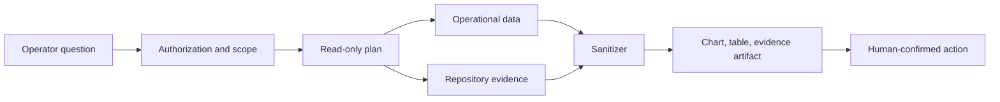

# Introducing the HotelByte Data Agent

Hotel operations questions rarely fit inside a single dashboard.

When a supplier has a spike in `hotelRates` failures, the answer may span MySQL order records, TDengine request logs, supplier-specific code paths, and a runbook written months ago. A dashboard can show the spike. It usually cannot explain whether the spike is a supplier behavior change, a credential issue, a mapping gap, or a business-rule mismatch.

The HotelByte Data Agent is built for that gap.

**TL;DR:** The Data Agent is not a natural-language SQL console. It is a governed investigation layer that turns an operational question into a bounded evidence package: backend authorization, read-only query intent, TDengine and MySQL evidence, repository context, deterministic masking, visual artifacts, and human-confirmable recommendations.

This post assumes familiarity with operational analytics, production logs, and basic data-access governance. For the full architecture and control model, read the whitepaper: [Governed Data Agent for Operational Intelligence](/en/whitepapers/wp26-data-agent-operational-intelligence/original/).

The first shipped slice is deliberately small: it handles platform-only supplier reliability questions, runs bounded TDengine aggregation and drilldown paths, treats stale or missing MySQL snapshots as evidence gaps rather than fallback truth, masks supplier identifiers, and renders only the live artifact returned by the backend.

## From Dashboard to Investigation

The Data Agent gives platform operators a conversational workspace for operational data questions. Instead of starting with a table name or a log query, the operator starts with the question:

> Which supplier has the highest hotelRates error rate in the last 24 hours, after normalizing by request volume?

The agent's job is not just to answer in prose. A useful response should show:

- The SQL or time-series query intent.
- The source systems involved.
- The code or documentation that explains the business logic.
- A visual result shape.
- A plain-language interpretation.
- A recommended next action for a human to confirm.

That is the difference between a chatbot and an operational investigation assistant.

## Why Repository Context Matters

Operational data is full of fields whose meaning is defined in code. A status value, fallback rule, supplier mask, or retry path may look obvious until a supplier integration adds an exception.

The Data Agent is designed to search both data and business logic. It can connect runtime evidence to repository and documentation evidence, so the explanation is grounded in the same implementation that powers the platform.

This matters most during incidents. The fastest answer is not always the safest answer. A repository-aware agent can say, "This metric points to supplier ALPHA, and the relevant masking or fallback rule is defined in this service path," instead of making a generic guess from the chart.

## Governance First

The first version is intentionally platform-only. The agent can deal with cross-tenant data, supplier telemetry, commercial fields, credentials, and logs. That surface needs a strict governance model:

- Only platform users can access the page.
- Backend authorization remains the source of truth.
- Sensitive data is masked by default.
- Query generation must be read-only and source-bounded.
- Recommendations are drafts, not automatic data mutations.
- Each investigation should be auditable.

The UI reflects that stance: source selection, scope inputs, masking controls, conversation history, visual previews, and masked result tables are part of the workflow.

One important implementation detail: the chart and table are not sample data. They render the backend `data_ops_result` artifact. If the artifact is missing, the page shows an empty state. If a source is unavailable, the response shows a gap.

That distinction matters. A demo table can make a feature look finished while hiding missing backend evidence. The Data Agent takes the opposite position: no artifact, no result. Missing sources are part of the answer.

## What Operators Get

The Data Agent now lives inside the existing Agent Workbench as the `data-ops` profile. The experience keeps the normal run/message workflow and adds two data-specific result views:

- Messages: the multi-turn investigation, evidence, and recommendation trail.
- Visuals: charts that make trend, volume, and redaction impact scannable.
- Results: structured masked data previews before export or follow-up.

This keeps the operator in control. The agent can accelerate the investigation, but the human still reviews the evidence and decides the operational action.

## A Practical Example

A platform operator asks:

> Compare MySQL order status and TDengine logs to find orders confirmed internally but failing supplier callback validation.

A mature Data Agent response should:

1. Build a read-only query plan for order state and callback telemetry.
2. Explain the join keys and time window.
3. Mask order, trace, token, credential, and commercial identifiers.
4. Show a chart of mismatches over time.
5. Link to the code path that decides confirmation and callback handling.
6. Recommend whether to inspect supplier credentials, recent deploys, or a specific trace scope.

That workflow compresses work that would otherwise require a dashboard, a SQL editor, a log query, and a code search session.

## Where This Goes Next

The product direction is clear: a governed data co-pilot for platform operations. The next layer is a broader backend execution engine: schema allowlists, richer query planning, more read-only adapters, repository indexing, sanitizer test vectors, and audit trails.

The LLM remains an interpreter, not a database driver. The system first builds a governed evidence package from known data and code sources; the model then explains it, asks follow-up questions, and drafts action recommendations. The knowledge base is maintained as a source catalog that maps business questions to tables, telemetry fields, code paths, and runbooks.

The end goal is not to replace operators. It is to give them a faster, safer path from question to evidence-backed action.

## Read The Full Whitepaper

The full whitepaper is the reading path for the complete control model. It goes deeper on source adapters, sanitizer behavior, artifact schema, fail-closed handling, audit boundaries, and verification paths:

- [English whitepaper](/en/whitepapers/wp26-data-agent-operational-intelligence/original/)
- [中文白皮书](/zh/whitepapers/wp26-data-agent-operational-intelligence/original/)
