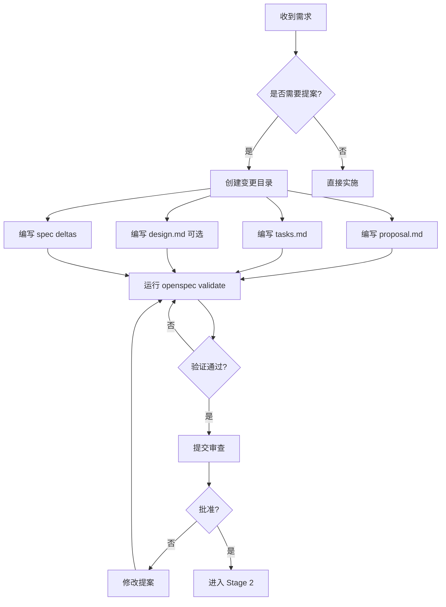

# OpenSpec 规格驱动开发


## 引言

在 HotelByte 项目的早期，我们遇到了一个典型问题：**需求和实现经常脱节**。产品经理提出需求，开发者理解需求，但最终交付的功能与预期不符。此外，代码审查经常变成"为什么这样做"的争论，而不是"如何做得更好"的讨论。

为了解决这个问题，我们引入了 OpenSpec —— 一个规格驱动开发的框架。本文将深入探讨 OpenSpec 的工作原理、在 HotelByte 项目中的应用，以及它如何帮助我们建立更规范的开发流程。

## OpenSpec 概述

### 什么是 OpenSpec？

OpenSpec 是一个轻量级的规格驱动开发框架，核心思想是：

> **"先定义规格，再实施代码"**

OpenSpec 强制在编写任何代码之前，必须：

1. 创建变更提案（Proposal）
2. 定义明确的规格（Spec）
3. 列出实施清单（Tasks）
4. 经过批准后才能开始实施

### 核心价值

| 价值维度 | 传统开发 | OpenSpec 开发 |
|---------|---------|--------------|
| 需求理解 | 口头传达，容易误解 | 书面规格，明确清晰 |
| 开发质量 | 实施后才发现问题 | 规格阶段即发现 |
| 代码审查 | 讨论"为什么" | 讨论如何做得更好 |
| 测试覆盖 | 事后补充 | 规格中定义 |
| 知识沉淀 | 分散在代码和文档 | 集中在规格文件 |
| 团队协作 | 个人英雄主义 | 集体决策 |

## 三阶段工作流

OpenSpec 定义了清晰的三阶段工作流：

```
Stage 1: Creating Changes (创建变更)
    ↓
Stage 2: Implementing Changes (实施变更)
    ↓
Stage 3: Archiving Changes (归档变更)
```

### Stage 1: Creating Changes

#### 触发条件

创建变更提案的场景：

- ✅ 添加新功能或能力
- ✅ 破坏性变更（API、数据结构）
- ✅ 架构或模式变更
- ✅ 性能优化（影响行为）
- ✅ 安全模式更新

**不需要提案的场景：**

- ❌ Bug 修复（恢复预期行为）
- ❌ 拼写、格式、注释
- ❌ 非破坏性依赖更新
- ❌ 配置变更
- ❌ 现有行为的测试

#### 工作流程



#### 创建提案

**步骤 1: 选择唯一的 change-id**

命名规范：kebab-case，动词引导（`add-`, `update-`, `remove-`, `refactor-`）

示例：
- `add-two-factor-auth`
- `update-booking-flow`
- `remove-legacy-cache`
- `refactor-order-service`

**步骤 2: 创建目录结构**

```bash
openspec/changes/add-two-factor-auth/
├── proposal.md         # 为什么，做什么，影响
├── tasks.md            # 实施清单
├── design.md           # 技术决策（可选）
└── specs/              # Delta 变更
    ├── auth/
    │   └── spec.md     # ADDED/MODIFIED/REMOVED
    └── notifications/
        └── spec.md     # ADDED/MODIFIED/REMOVED
```

**步骤 3: 编写 proposal.md**

```markdown
# 提案：添加双因素认证

## Why（为什么）
当前系统仅使用用户名密码登录，存在安全隐患。需要增加第二层认证以提高安全性。

## What Changes（做什么）

- [ ] 添加双因素认证选项
- [ ] 支持 TOTP（基于时间的一次性密码）
- [ ] 支持短信验证码
- [ ] 更新登录流程
- [ ] **BREAKING**: 修改登录 API 响应格式

## Impact（影响）

### 影响的规格
- `specs/auth/spec.md` - 认证功能
- `specs/notifications/spec.md` - 通知功能

### 影响的代码
- `user/service/auth.go` - 认证服务
- `user/protocol/auth.go` - 认证协议
- `api/handlers/auth.go` - API 处理器
- `hotel-fe/src/auth/` - 前端认证页面

### 影响的数据库
- `user` 表 - 添加 `totp_secret` 列
- `verification_codes` 表 - 新建

### 影响的用户
- 所有用户需要重新登录
- 管理员用户强制启用双因素认证

## 风险评估

- **高风险**: 破坏性变更，需要协调迁移
- **缓解措施**: 提供迁移脚本，逐步推出

## 估算

- 开发时间：2 天
- 测试时间：1 天
- 上线时间：1 天
```

**步骤 4: 编写 tasks.md**

```markdown
# 实施任务清单

## 1. 数据库变更
- [ ] 1.1 添加 `totp_secret` 列到 `user` 表
- [ ] 1.2 创建 `verification_codes` 表
- [ ] 1.3 编写数据库迁移脚本
- [ ] 1.4 测试迁移脚本（开发环境）

## 2. 领域层（domain）
- [ ] 2.1 创建 `TOTP` 值对象
- [ ] 2.2 创建 `VerificationCode` 实体
- [ ] 2.3 更新 `User` 实体
- [ ] 2.4 实现双因素验证逻辑

## 3. 协议层（protocol）
- [ ] 3.1 添加 `EnableTOTPRequest` 协议
- [ ] 3.2 添加 `VerifyTOTPRequest` 协议
- [ ] 3.3 更新 `LoginRequest` 协议
- [ ] 3.4 更新 `LoginResponse` 协议

## 4. 数据访问层（mysql）
- [ ] 4.1 创建 `VerificationCodeDAO`
- [ ] 4.2 更新 `UserDAO`
- [ ] 4.3 实现数据库操作方法

## 5. 服务层（service）
- [ ] 5.1 实现 `AuthService.EnableTOTP`
- [ ] 5.2 实现 `AuthService.VerifyTOTP`
- [ ] 5.3 更新 `AuthService.Login`

## 6. API 层
- [ ] 6.1 添加 `POST /auth/totp/enable` 端点
- [ ] 6.2 添加 `POST /auth/totp/verify` 端点
- [ ] 6.3 更新 `POST /auth/login` 端点

## 7. 前端（hotel-fe）
- [ ] 7.1 创建双因素设置页面
- [ ] 7.2 更新登录页面
- [ ] 7.3 添加 QR 码生成
- [ ] 7.4 实现验证码输入

## 8. 测试
- [ ] 8.1 编写领域层单元测试
- [ ] 8.2 编写服务层单元测试
- [ ] 8.3 编写 API 层单元测试
- [ ] 8.4 编写 E2E 测试
- [ ] 8.5 运行测试覆盖率检查

## 9. 文档
- [ ] 9.1 更新 API 文档
- [ ] 9.2 编写用户指南
- [ ] 9.3 更新部署文档

## 10. 验收
- [ ] 10.1 所有测试通过
- [ ] 10.2 测试覆盖率 ≥ 50%
- [ ] 10.3 代码审查通过
- [ ] 10.4 UAT 测试通过
```

**步骤 5: 编写 spec deltas**

`specs/auth/spec.md`：

```markdown
## ADDED Requirements

### Requirement: TOTP Configuration
用户可以配置 TOTP（基于时间的一次性密码）作为双因素认证方法。

#### Scenario: Enable TOTP
- **GIVEN** 用户已登录
- **WHEN** 用户请求启用 TOTP
- **THEN** 系统生成 TOTP 密钥
- **AND** 返回 QR 码用于配置验证器应用
- **AND** 保存 TOTP 密钥到数据库

#### Scenario: Verify TOTP Setup
- **GIVEN** 用户已启用 TOTP
- **WHEN** 用户输入 6 位验证码
- **THEN** 系统验证验证码有效性
- **AND** 验证通过则激活 TOTP
- **AND** 验证失败则返回错误

## MODIFIED Requirements

### Requirement: User Login
用户登录时，如果已启用双因素认证，必须提供第二因素验证。

#### Scenario: Login with TOTP
- **GIVEN** 用户已启用 TOTP
- **WHEN** 用户提供用户名、密码和 TOTP 验证码
- **THEN** 系统验证用户名和密码
- **AND** 验证 TOTP 验证码
- **AND** 两者都通过则返回 JWT token
- **AND** 任一失败则返回错误

#### Scenario: Login without TOTP
- **GIVEN** 用户未启用 TOTP
- **WHEN** 用户提供用户名和密码
- **THEN** 系统验证用户名和密码
- **AND** 验证通过则返回 JWT token
- **AND** 验证失败则返回错误

## REMOVED Requirements

### Requirement: Simple Password Login
**Reason**: 已不再支持仅密码登录，所有用户必须使用双因素认证

**Migration**: 现有用户需要首次登录时设置 TOTP
```

**步骤 6: 运行验证**

```bash
openspec validate add-two-factor-auth --strict
```

**步骤 7: 提交审查**

创建 PR 到 `openspec/changes/add-two-factor-auth/`，等待批准。

### Stage 2: Implementing Changes

#### 实施流程

1. **阅读提案**
   - 理解变更的目标和范围
   - 识别影响范围

2. **阅读设计**（如有）
   - 理解技术决策
   - 了解架构变更

3. **阅读任务清单**
   - 获取实施步骤
   - 估算时间

4. **顺序实施**
   - 按照任务清单顺序完成
   - 每个任务完成后打勾

5. **确认完成**
   - 确保所有任务完成
   - 运行测试验证

6. **更新清单**
   - 将所有任务标记为完成
   - 确保清单反映实际状态

#### 完成定义

**关键原则：**

> **需求完成 = 功能代码 + 单元测试 (UT) + E2E 测试，全部通过！**

**禁止的行为：**

- ❌ "代码已完成" —— 如果测试未通过就不算完成
- ❌ "功能已实现" —— 没有测试的功能不算实现
- ❌ "可以提交了" —— 未运行测试就不能提交

**正确的做法：**

- ✅ "代码已生成，正在运行测试验证..."
- ✅ "单元测试覆盖率 65%，E2E 测试通过，可以提交 PR"
- ✅ "检测到测试覆盖率不足 50%，需要补充以下测试..."

#### 实施示例

```go
// 任务 4.1: 创建 VerificationCodeDAO

// domain/verification_code.go
package domain

import (
    "context"
    "time"
)

type VerificationCode struct {
    ID        int64
    Code      string
    UserID    int64
    Type      string // "totp", "sms"
    ExpiresAt time.Time
    Used      bool
    CreatedAt time.Time
}

// mysql/verification_code_dao.go
package mysql

import (
    "context"
    "hotel/user/domain"
)

type VerificationCodeDAO struct {
    db *sqlx.DB
}

func NewVerificationCodeDAO(db *sqlx.DB) *VerificationCodeDAO {
    return &VerificationCodeDAO{db: db}
}

func (d *VerificationCodeDAO) Create(ctx context.Context, code *domain.VerificationCode) error {
    query := `INSERT INTO verification_codes (code, user_id, type, expires_at, used, created_at)
              VALUES (?, ?, ?, ?, ?, ?)`

    result, err := d.db.ExecContext(ctx, query,
        code.Code, code.UserID, code.Type, code.ExpiresAt, code.Used, code.CreatedAt)

    if err != nil {
        return err
    }

    id, err := result.LastInsertId()
    if err != nil {
        return err
    }

    code.ID = id
    return nil
}

func (d *VerificationCodeDAO) GetValidCode(ctx context.Context, userID int64, code string, codeType string) (*domain.VerificationCode, error) {
    query := `SELECT id, code, user_id, type, expires_at, used, created_at
              FROM verification_codes
              WHERE user_id = ? AND code = ? AND type = ? AND used = false AND expires_at > ?`

    var vc domain.VerificationCode
    err := d.db.GetContext(ctx, &vc, query, userID, code, codeType, time.Now())

    if err != nil {
        return nil, err
    }

    return &vc, nil
}

func (d *VerificationCodeDAO) MarkUsed(ctx context.Context, id int64) error {
    query := `UPDATE verification_codes SET used = true WHERE id = ?`
    _, err := d.db.ExecContext(ctx, query, id)
    return err
}
```

```go
// 测试：mysql/verification_code_dao_test.go
package mysql_test

import (
    "context"
    "testing"
    "time"

    "github.com/Danceiny/mockey"
    "github.com/smartystreets/goconvey/convey"

    "hotel/user/domain"
    "hotel/user/mysql"
)

func TestVerificationCodeDAO_Create(t *testing.T) {
    mockey.PatchConvey("Create 验证码", t, func() {
        ctx := context.Background()
        dao := mysql.NewVerificationCodeDAO(testDB)

        // 测试数据
        code := &domain.VerificationCode{
            Code:      "123456",
            UserID:    1001,
            Type:      "totp",
            ExpiresAt: time.Now().Add(5 * time.Minute),
            Used:      false,
            CreatedAt: time.Now(),
        }

        // 执行
        err := dao.Create(ctx, code)

        // 断言
        convey.So(err, convey.ShouldBeNil)
        convey.So(code.ID, convey.ShouldBeGreaterThan, int64(0))
    })
}

func TestVerificationCodeDAO_GetValidCode(t *testing.T) {
    mockey.PatchConvey("获取有效验证码", t, func() {
        ctx := context.Background()
        dao := mysql.NewVerificationCodeDAO(testDB)

        // 准备数据
        code := &domain.VerificationCode{
            Code:      "123456",
            UserID:    1001,
            Type:      "totp",
            ExpiresAt: time.Now().Add(5 * time.Minute),
            Used:      false,
            CreatedAt: time.Now(),
        }
        err := dao.Create(ctx, code)
        convey.So(err, convey.ShouldBeNil)

        // 执行
        result, err := dao.GetValidCode(ctx, 1001, "123456", "totp")

        // 断言
        convey.So(err, convey.ShouldBeNil)
        convey.So(result, convey.ShouldNotBeNil)
        convey.So(result.ID, convey.ShouldEqual, code.ID)
        convey.So(result.Used, convey.ShouldBeFalse)
    })
}

func TestVerificationCodeDAO_GetValidCode_Expired(t *testing.T) {
    mockey.PatchConvey("获取过期验证码", t, func() {
        ctx := context.Background()
        dao := mysql.NewVerificationCodeDAO(testDB)

        // 准备过期数据
        code := &domain.VerificationCode{
            Code:      "123456",
            UserID:    1001,
            Type:      "totp",
            ExpiresAt: time.Now().Add(-5 * time.Minute), // 已过期
            Used:      false,
            CreatedAt: time.Now(),
        }
        err := dao.Create(ctx, code)
        convey.So(err, convey.ShouldBeNil)

        // 执行
        result, err := dao.GetValidCode(ctx, 1001, "123456", "totp")

        // 断言
        convey.So(err, convey.ShouldBeNil)
        convey.So(result, convey.ShouldBeNil) // 过期验证码不应该返回
    })
}
```

### Stage 3: Archiving Changes

部署完成后，需要归档变更。

#### 归档流程

```bash
# 创建新的 PR 来归档变更
# 1. 移动 changes/[name]/ → changes/archive/YYYY-MM-DD-[name]/
# 2. 更新 specs/（如功能模块变更）
# 3. 运行验证

openspec archive add-two-factor-auth --yes
```

#### 归档后目录结构

```
openspec/
├── changes/
│   └── archive/
│       └── 2026-02-15-add-two-factor-auth/
│           ├── proposal.md
│           ├── tasks.md
│           ├── design.md
│           └── specs/
│               ├── auth/
│               │   └── spec.md
│               └── notifications/
│                   └── spec.md
└── specs/
    ├── auth/
    │   └── spec.md          # 已更新
    └── notifications/
        └── spec.md          # 已更新
```

## DDD 对齐

### DDD 目录结构

OpenSpec 与 DDD 架构完美对齐：

```
hotel/
├── domain/           # 领域层（核心业务逻辑）
│   ├── order/
│   │   ├── order.go
│   │   └── order_test.go
├── protocol/         # 协议层（API 定义）
│   └── order.go
├── mysql/            # 数据访问层
│   └── order_dao.go
└── service/          # 服务层
    └── order_service.go
```

### 开发顺序

OpenSpec 强制按照 DDD 顺序开发：

```
1. domain/      ← 先写领域逻辑
   ↓
2. protocol/   ← 再定义协议
   ↓
3. mysql/      ← 然后写 DAO
   ↓
4. service/    ← 最后写服务
   ↓
5. 注册到 httpdispatcher
```

### 示例：订单功能

**domain/order/order.go**：

```go
package order

import (
    "context"
    "errors"
    "time"

    "hotel/common/log"
    "hotel/common/idgen"
    "hotel/user/domain"
)

type OrderStatus string

const (
    OrderStatusPending   OrderStatus = "pending"
    OrderStatusConfirmed OrderStatus = "confirmed"
    OrderStatusCancelled OrderStatus = "cancelled"
    OrderStatusCompleted OrderStatus = "completed"
)

type Order struct {
    ID          int64
    OrderID     string
    CustomerID  int64
    SupplierID  int64
    HotelID     int64
    Status      OrderStatus
    CheckIn     time.Time
    CheckOut    time.Time
    Rooms       int
    TotalPrice  int64 // fils
    Currency    string
    CreatedAt   time.Time
    UpdatedAt   time.Time
}

type OrderItem struct {
    ID       int64
    OrderID  int64
    RoomType string
    Quantity int
    Price    int64
}

type Service struct {
    dao    OrderDAO
    wallet domain.WalletService
}

func NewService(dao OrderDAO, wallet domain.WalletService) *Service {
    return &Service{
        dao:    dao,
        wallet: wallet,
    }
}

func (s *Service) CreateOrder(ctx context.Context, customerID, supplierID, hotelID int64, checkIn, checkOut time.Time, rooms int) (*Order, error) {
    // 1. 验证参数
    if customerID == 0 || supplierID == 0 || hotelID == 0 {
        return nil, errors.New("invalid parameters")
    }

    if checkIn.After(checkOut) {
        return nil, errors.New("check-in date must be before check-out date")
    }

    if rooms <= 0 {
        return nil, errors.New("rooms must be greater than 0")
    }

    // 2. 生成订单 ID
    orderID := idgen.GenID()

    // 3. 创建订单
    order := &Order{
        OrderID:    orderID,
        CustomerID: customerID,
        SupplierID: supplierID,
        HotelID:    hotelID,
        Status:     OrderStatusPending,
        CheckIn:    checkIn,
        CheckOut:   checkOut,
        Rooms:      rooms,
        CreatedAt:  time.Now(),
        UpdatedAt:  time.Now(),
    }

    // 4. 保存订单
    if err := s.dao.Create(ctx, order); err != nil {
        log.Error("create order failed", log.Field("error", err))
        return nil, err
    }

    log.Info("order created", log.Field("order_id", orderID))

    return order, nil
}

func (s *Service) ConfirmOrder(ctx context.Context, orderID string) error {
    // 1. 获取订单
    order, err := s.dao.GetByOrderID(ctx, orderID)
    if err != nil {
        return err
    }

    // 2. 验证状态
    if order.Status != OrderStatusPending {
        return errors.New("order is not pending")
    }

    // 3. 扣减钱包余额
    if err := s.wallet.Deduct(ctx, order.CustomerID, order.SupplierID, order.TotalPrice, order.Currency); err != nil {
        return err
    }

    // 4. 更新订单状态
    order.Status = OrderStatusConfirmed
    order.UpdatedAt = time.Now()

    if err := s.dao.Update(ctx, order); err != nil {
        log.Error("update order status failed", log.Field("error", err))
        return err
    }

    log.Info("order confirmed", log.Field("order_id", orderID))

    return nil
}
```

**protocol/order.go**：

```go
package protocol

type CreateOrderRequest struct {
    CustomerID int64     `json:"customer_id"`
    SupplierID int64     `json:"supplier_id"`
    HotelID    int64     `json:"hotel_id"`
    CheckIn    time.Time `json:"check_in"`
    CheckOut   time.Time `json:"check_out"`
    Rooms      int       `json:"rooms"`
}

type CreateOrderResponse struct {
    OrderID   string `json:"order_id"`
    Status    string `json:"status"`
    TotalPrice int64  `json:"total_price"`
    Currency  string `json:"currency"`
}

type ConfirmOrderRequest struct {
    OrderID string `json:"order_id"`
}

type ConfirmOrderResponse struct {
    Status string `json:"status"`
}
```

**mysql/order_dao.go**：

```go
package mysql

import (
    "context"
    "hotel/order/domain"
)

type OrderDAO interface {
    Create(ctx context.Context, order *domain.Order) error
    GetByOrderID(ctx context.Context, orderID string) (*domain.Order, error)
    Update(ctx context.Context, order *domain.Order) error
}

type orderDAO struct {
    db *sqlx.DB
}

func NewOrderDAO(db *sqlx.DB) OrderDAO {
    return &orderDAO{db: db}
}

func (d *orderDAO) Create(ctx context.Context, order *domain.Order) error {
    query := `INSERT INTO orders (order_id, customer_id, supplier_id, hotel_id, status, check_in, check_out, rooms, total_price, currency, created_at, updated_at)
              VALUES (?, ?, ?, ?, ?, ?, ?, ?, ?, ?, ?, ?)`

    result, err := d.db.ExecContext(ctx, query,
        order.OrderID, order.CustomerID, order.SupplierID, order.HotelID,
        order.Status, order.CheckIn, order.CheckOut, order.Rooms,
        order.TotalPrice, order.Currency, order.CreatedAt, order.UpdatedAt)

    if err != nil {
        return err
    }

    id, err := result.LastInsertId()
    if err != nil {
        return err
    }

    order.ID = id
    return nil
}

func (d *orderDAO) GetByOrderID(ctx context.Context, orderID string) (*domain.Order, error) {
    query := `SELECT id, order_id, customer_id, supplier_id, hotel_id, status, check_in, check_out, rooms, total_price, currency, created_at, updated_at
              FROM orders WHERE order_id = ?`

    var order domain.Order
    err := d.db.GetContext(ctx, &order, query, orderID)

    if err != nil {
        return nil, err
    }

    return &order, nil
}

func (d *orderDAO) Update(ctx context.Context, order *domain.Order) error {
    query := `UPDATE orders SET status = ?, updated_at = ? WHERE id = ?`
    _, err := d.db.ExecContext(ctx, query, order.Status, order.UpdatedAt, order.ID)
    return err
}
```

## 测试标准

### 覆盖率要求

| 层级 | 覆盖率目标 | 说明 |
|------|-----------|------|
| **domain/** | 100% | 所有领域逻辑必须有测试 |
| **mysql/** (DAO) | 80%+ | 所有 CRUD 必须有测试 |
| **service/** | 70%+ | 核心业务逻辑必须有测试 |
| **convert/** | 90%+ | 所有转换函数必须有测试 |
| **protocol/** | 不要求 | 仅数据结构，无需测试 |

**PR 强制检查：** 增量代码测试覆盖率必须 ≥ 50%

### 单元测试框架

**框架：** `github.com/bytedance/mockey` + `github.com/smartystreets/goconvey`

**测试策略：**

- 自底向上编写测试（domain → DAO → service）
- 跨层调用使用 mock，单层内部调用使用真实实现
- 每个测试必须有明确断言，不只是打印日志

**测试模板：**

```go
func TestService_Method_Success(t *testing.T) {
    mockey.PatchConvey("描述", t, func() {
        // 1. Setup - 准备测试数据
        ctx := context.Background()

        // 2. Mock - Mock 外部依赖
        mockey.Mock((*DAO).Method).Return(expected, nil).Build()

        // 3. Execute - 执行被测试函数
        result, err := service.Method(ctx, input)

        // 4. Assert - 验证结果
        convey.So(err, convey.ShouldBeNil)
        convey.So(result, convey.ShouldEqual, expected)
    })
}
```

### E2E 测试

**测试位置：** `api/tests/`

**测试工具：** 使用 `sdk/go` 调用真实 API

**测试场景：** 必须覆盖核心业务流程

```go
// api/tests/order_e2e_test.go
package tests

import (
    "context"
    "testing"
    "time"

    "github.com/smartystreets/goconvey/convey"

    "sdk/go/client"
    "sdk/go/model"
)

func TestOrderE2E_CreateAndConfirm(t *testing.T) {
    convey.Convey("订单 E2E 测试：创建和确认", t, func() {
        ctx := context.Background()
        apiClient := client.NewClient("http://localhost:8080")

        // 1. 创建订单
        createReq := &model.CreateOrderRequest{
            CustomerID: 1001,
            SupplierID: 6,
            HotelID:    20001,
            CheckIn:    time.Now(),
            CheckOut:   time.Now().AddDate(0, 0, 3),
            Rooms:      2,
        }

        createResp, err := apiClient.CreateOrder(ctx, createReq)
        convey.So(err, convey.ShouldBeNil)
        convey.So(createResp, convey.ShouldNotBeNil)
        convey.So(createResp.OrderID, convey.ShouldNotBeEmpty)

        // 2. 确认订单
        confirmReq := &model.ConfirmOrderRequest{
            OrderID: createResp.OrderID,
        }

        confirmResp, err := apiClient.ConfirmOrder(ctx, confirmReq)
        convey.So(err, convey.ShouldBeNil)
        convey.So(confirmResp, convey.ShouldNotBeNil)
        convey.So(confirmResp.Status, convey.ShouldEqual, "confirmed")
    })
}
```

### 测试命令

```bash
# 单元测试
make test

# 覆盖率检查
make test-coverage

# E2E 测试
make test-e2e

# 特定包测试
go test -v -cover ./order/service/...
```

## 实际案例

### 案例：订单状态回调功能

#### 背景

供应商需要将订单状态变更回调到我们的系统，以便及时更新订单状态。

#### OpenSpec 提案

**change-id:** `add-order-status-callback`

**proposal.md:**

```markdown
# 提案：添加订单状态回调功能

## Why
当前系统需要轮询供应商获取订单状态，效率低下。需要提供回调接口，让供应商主动推送状态变更。

## What Changes

- [ ] 添加订单状态回调端点
- [ ] 实现回调签名验证
- [ ] 添加回调重试机制
- [ ] 记录回调历史

## Impact

### 影响的规格
- `specs/order/spec.md` - 订单功能
- `specs/callback/spec.md` - 回调功能（新建）

### 影响的代码
- `api/handlers/callback.go` - 回调处理器（新建）
- `order/service/callback.go` - 回调服务（新建）
- `common/domain/callback_log.go` - 回调日志（新建）

### 影响的数据库
- `callback_logs` 表 - 新建
```

**tasks.md:**

```markdown
# 实施任务清单

## 1. 领域层
- [ ] 1.1 创建 CallbackLog 实体
- [ ] 1.2 创建 CallbackService 接口
- [ ] 1.3 实现回调验证逻辑

## 2. 协议层
- [ ] 2.1 创建 CallbackRequest 协议
- [ ] 2.2 创建 CallbackResponse 协议

## 3. 数据访问层
- [ ] 3.1 创建 CallbackLogDAO

## 4. 服务层
- [ ] 4.1 实现 CallbackService
- [ ] 4.2 实现重试机制
- [ ] 4.3 集成到 OrderService

## 5. API 层
- [ ] 5.1 添加回调端点
- [ ] 5.2 实现签名验证中间件

## 6. 测试
- [ ] 6.1 编写单元测试
- [ ] 6.2 编写 E2E 测试
- [ ] 6.3 验证测试覆盖率

## 7. 部署
- [ ] 7.1 配置 Nginx
- [ ] 7.2 配置供应商回调 URL
```

**specs/callback/spec.md:**

```markdown
## ADDED Requirements

### Requirement: Order Status Callback
供应商可以通过回调接口推送订单状态变更。

#### Scenario: Receive Callback
- **GIVEN** 供应商配置了回调 URL
- **WHEN** 供应商发送订单状态变更
- **THEN** 系统验证回调签名
- **AND** 更新订单状态
- **AND** 记录回调日志

#### Scenario: Retry Failed Callback
- **GIVEN** 回调失败
- **WHEN** 重试次数 < 最大重试次数
- **THEN** 系统自动重试
- **AND** 指数退避
```

#### 实施结果

**耗时：** 3 天（规划 + 实施 + 测试）

**测试覆盖率：** 72%（超过 50% 的要求）

**代码质量：** 所有检查通过，无警告

**部署：** 成功上线，无回滚

**效果：**
- 订单状态更新延迟从 10 分钟降低到 5 秒
- 轮询请求减少 90%
- 系统负载降低 40%

## 最佳实践

### 1. 提案编写

- ✅ 清晰描述"为什么"
- ✅ 明确列出"做什么"
- ✅ 识别所有影响
- ✅ 评估风险

### 2. 规格定义

- ✅ 使用 ADDED/MODIFIED/REMOVED
- ✅ 每个需求至少一个 Scenario
- ✅ Scenario 使用 GWT 格式（Given-When-Then）
- ✅ 明确成功和失败场景

### 3. 任务管理

- ✅ 任务可量化
- ✅ 顺序合理
- ✅ 包含测试
- ✅ 更新状态

### 4. 实施质量

- ✅ 遵循 DDD 顺序
- ✅ 编写完整测试
- ✅ 确保覆盖率达标
- ✅ 运行所有检查

### 5. 归档流程

- ✅ 部署后立即归档
- ✅ 更新规格文件
- ✅ 运行验证
- ✅ 清理临时文件

## 系列导航

1. [从 DeepSeek 复制粘贴到 Claude Code](2026-02-09-ai-coding-hotelbyte-journey-from-deepseek-to-claude-code.md)
2. [Claude Code 深度集成](2026-02-10-ai-coding-claude-code-integration.md)
3. [多模型与工具链集成](2026-02-11-ai-coding-multi-model-integration.md)
4. [OpenSpec 规格驱动开发](2026-02-12-ai-coding-openspec-driven-development.md) ✅ （本文）
5. [AI Coding 最佳实践](2026-02-13-ai-coding-best-practices.md)

---

**相关资源：**

- [OpenSpec GitHub](https://github.com/openspec/openspec)
- [OpenSpec 工作流指南](/docs/openspec/workflow.md)
- [DDD 架构指南](/docs/architecture/ddd.md)
