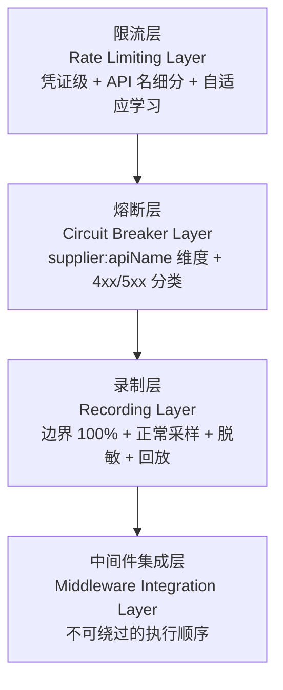
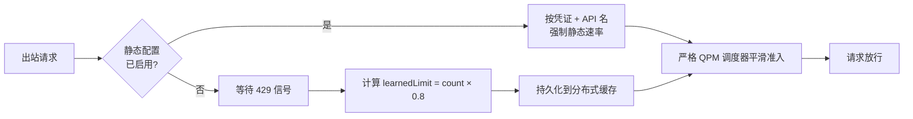
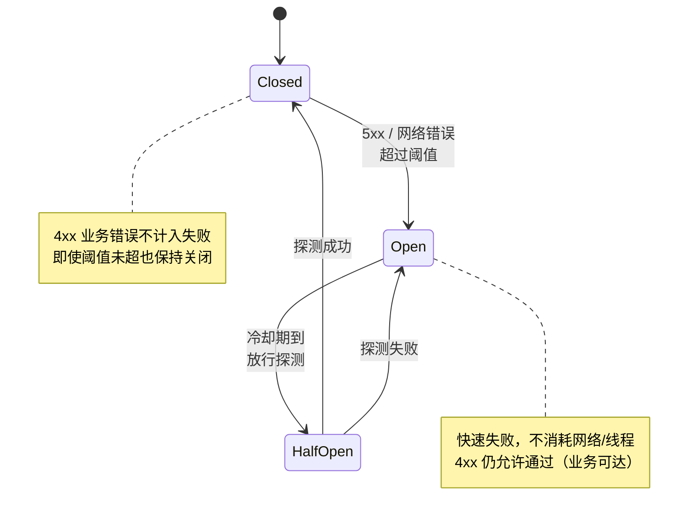

<div class="whitepaper-reader-note">
  <strong>阅读路径：</strong>这是 WP07 完整白皮书。若需要更短的读者入口，请先阅读 <a href="/zh/whitepapers/wp07-supplier-resilience/">博客导读</a>。也可以浏览 <a href="/zh/whitepapers/">HotelByte 白皮书索引</a>。
</div>

# 供应商韧性工程

**HotelByte 技术白皮书 | Version 2.0 | 中文同级公开安全版**

本资产对应英文 canonical whitepaper：`docs/whitepapers/07-supplier-resilience-engineering.md`。

---

## 执行摘要

**适合读者：** 平台工程师、企业架构师、供应商集成负责人、SRE，以及评审 HotelByte 供应商集成能力是否可治理、可验证、可运营的技术团队。

**TL;DR：** 真正的供应商韧性不是简单增加重试次数，而是把错误分类、限流、熔断、记录、重放和审计放进一条受治理的请求链路。

> **中心判断：** 供应商韧性的起点是错误分类，而不是重试策略。

想象一次取消接口的轻微抖动：搜索 API 完全健康，却被同一个熔断器一起屏蔽；4xx 业务错误（"该日期已满房"）撑爆了为 5xx 熔断设计的失败预算；HTTP 429 限流信号被自动重试淹没，反而拖垮了供应商的容量。这一切都不是因为重试不够多，而是因为重试先于分类发生。

HotelByte 是一个全球酒店 API 分销平台，聚合了来自 27+ 异构供应商的库存。这些供应商在可靠性、延迟特征、限流策略和失败模式上差异巨大。任何一个供应商降级，都可能在没有工程化隔离边界的情况下级联成全平台不稳定。

本文介绍 HotelByte 平台内置的供应商韧性工程层：一个多层次控制系统，能隔离供应商失败、适配运行时条件，并在上游依赖承压时维持面向客户的可用性。该系统把自适应限流、按供应商熔断、流量录制与回放、统一中间件装配组合成一套协同防御架构。结果是一个供应商宕机被限制、限流违规被预防而非事后补救、运营团队对每一次韧性决策都拥有完整可观测性的平台。

---

## 问题定义：为什么这不是普通功能

供应商韧性工程不应被当成一个孤立功能来读。在酒店分销平台里，供应商集成通常同时连接供应商差异、客户体验、平台稳定性、业务规则和外部审核要求。只要边界不清，局部实现就会把风险传递到搜索、预订、支付、客服或数据运营链路。

因此，HotelByte 不把供应商韧性工程当作"写一段业务代码"来处理，而是把它看作工程控制面。这个控制面需要回答四个问题：

- 当前能力要解决的真实业务风险是什么？
- 哪些事实、状态或字段可以支撑判断？
- 哪些动作必须有明确边界，不能交给隐式约定？
- 完成声明如何被测试、日志、审计或回放证据证明？

只有这些问题都有答案，能力才适合进入企业级交付和外部技术评审。

---

## 适用范围

本文涵盖 HotelByte 平台内管控出站供应商流量的技术控制点，具体包括：

- **供应商 API 凭证的限流与流量整形** —— 静态配置 + 自适应学习 + 严格 QPM 调度。
- **按供应商端点的熔断隔离** —— `supplier:apiName` 维度的失败预算管理。
- **流量录制与回放** —— 边界事件 100% 录制、正常流量采样、敏感字段脱敏、回放验证。
- **中间件集成** —— 在请求生命周期统一装配韧性控制。
- **可观测与审计** —— 指标、结构化日志、回放证据。

本白皮书不涵盖通用平台基础设施韧性（如计算自动扩缩、数据库复制）或面向客户 API 的限流，这些内容由其他白皮书覆盖。

---

## 核心目标

供应商韧性工程计划致力于实现以下运营目标：

1. **隔离（Isolation）** —— 阻止单家供应商集成的失败影响其他供应商流量或降低整个平台的可用性。
2. **自适应（Adaptation）** —— 在无需人工介入的前提下，根据供应商反馈（HTTP 429、延迟尖峰）自动调整流量速率。
3. **预防（Prevention）** —— 阻止请求到达已经出现失败征兆的供应商，减少容量浪费并改善响应时间。
4. **可观测（Observability）** —— 以足够精度记录每条韧性决策与供应商交互，支持事后复盘与合规验证。
5. **可恢复（Recoverability）** —— 启用对供应商交互的确定性回放，在不暴露在线流量的前提下验证修复与复现问题。

---

## 设计原则

供应商韧性层建立在五条核心设计原则之上，每条都从一次具体的事故叙事出发：

### 失败时快速响应，证据驱动恢复（Fail Fast and Recover Gracefully）

> "让请求在缓慢队列里排队，不如直接拒绝。"

当供应商出现降级时，平台应快速识别并返回受控响应，而不是把请求挂在长队列或重试循环里。恢复必须是渐进的、有证据的：在供应商证明持续健康之前，不会被重新接纳到全量流量。这条原则保护下游容量并改善感知响应。

### 从反馈中学习（Learning from Feedback）

> "HTTP 429 不是错误。HTTP 429 是供应商在告诉你它现在的容量上限。"

供应商通过响应码、延迟分布和限流头传递自己的运行状态。平台把这些反馈视为控制信号而非错误条件。HTTP 429 被用来计算安全运行阈值，持久化并自动应用到后续流量——无需人工调参。

### 纵深防御（Defense in Depth）

> "没有任何单一控制足以应对 27+ 异构供应商。"

限流防止过载；熔断隔离失败；流量录制提供取证能力；中间件装配确保所有集成路径的一致应用。每层独立可替换、可测试。

### 接口先行（Interface-First Design）

> "韧性组件必须能换。供应商变了你不能重写整个平台。"

所有韧性组件由接口定义（如 `BoundaryDetector`、`SamplingStrategy`、`RecordingStore`），而不是具体实现。这让组件能扩展、替换或为测试而 Mock，无需修改消费方代码。

### 维度隔离（Dimension Isolation）

> "搜索 API 失败不应吃掉取消 API 的失败预算。"

控制被约束在最细的可实践维度。限流运行在凭证级，可进一步按 API 名限定；熔断器按 `supplier:apiName` 对隔离。这阻止单一故障端点消耗整家供应商或整个凭证的失败预算。

---

## 分层架构

韧性层组织为四个功能层，每层针对一类独立的风险。**省略任何一层都会把风险传递给相邻层**，下文每个 H3 都附"省略会发生什么"反证。



四层共同形成一条工作链路：输入先被规范化，关键状态被约束，风险在控制点被拦截，输出携带可审计上下文，最后通过测试、回放或运行时指标证明结果。

### 限流层



> "省略它：供应商会用自己的 HTTP 429 把我们打挂。"

限流层通过双引擎架构对出站流量进行控制，引擎可通过 feature flag 选择：

**配置驱动引擎** 应用按 API 凭证定义的静态限速。限速可全局生效，也可按 API 名（`byApi`）细分，从而对高成本操作（如取消、预订）单独压低速率。

**自适应学习引擎** 响应运行时反馈。当检测到 HTTP 429 时，系统从近期请求窗口计算安全阈值（`learnedLimit = count × 0.8`），持久化到分布式缓存。后续流量被节流到这个学到的限值，直到供应商证明有能力吸收更多负载。这消除了供应商配额变化时的人工调参需求。

**严格 QPM 调度器** 提供平滑的请求排队，避免突发准入，从而在区间边界仍持续遵守限值，而非"先挤爆再挨饿"。

所有限流决策都发出 `SupplierRateLimitWaitTiming` 时序指标以供运营可见。

### 熔断层



> "省略它：单个异常端点会拖垮整家供应商的搜索/预订体验。"

熔断器在 `supplier:apiName` 维度提供失败状态隔离。每个隔离的熔断器独立监控自己的失败率。

熔断器区分**瞬态基础设施失败**与**业务级错误**：网络超时、连接失败、HTTP 5xx 计入失败阈值并可能触发熔断器跳闸；HTTP 4xx 业务错误（无效目的地代码、房态已满）被视为预期的应用结果，不参与熔断器状态变化。

熔断器打开时，对该供应商端点的请求立即拒绝，不消耗网络资源也不增加延迟。熔断器定期放行探测请求以测试恢复。一旦供应商表现出成功，熔断器闭合，正常流量恢复。

所有熔断拒绝由 `SupplierCircuitBreakerRejected` 指标计数，用于告警与容量规划。

### 录制层

> "省略它：事故复盘只能靠人工口述历史。"

流量录制层捕获供应商交互，用于事后分析、合规证据和回归测试。

**边界检测器** 根据可配置规则，把请求分类为边界触发类（HTTP 400+、超时、限流头）或正常流量。

**采样策略** 保证高价值流量被留存：边界触发请求以 100% 录制，正常流量按比例采样。这在不丢失事故关键数据的前提下优化存储。

**脱敏器** 应用基于静态正则的脱敏处理，在存储前清除敏感数据（信用卡号、邮箱、认证令牌），确保录制流量不会成为合规负担。

录制数据存放在现有运营日志基础设施中，复用既有的保留、备份与访问控制策略。

**回放系统** 支持三种查询模式：按请求签名查找、按边界类型查找、按时间范围列出。**回放播放器** 对当前供应商实现执行已存储请求，并报告成功、耗时与错误状态——支持修复的确定性验证与供应商行为变化的可重复测试。

### 中间件集成层

> "省略它：某个适配器会偷偷用裸 HTTP 客户端绕过所有控制。"

所有韧性控制通过统一中间件链应用，对每次供应商请求一致执行：

```
cache → rate limit → circuit breaker → proxy → HTTP transport → error mapping → cache write
```

这个顺序刻意：缓存查询绕过所有下游控制以提升效率；限流排在熔断器评估之前，使队列中请求不会被过早拒绝；熔断器保护实际 HTTP 传输；错误映射把供应商特定响应翻译为平台标准结果；缓存写入填充结果缓存供后续相同请求使用。


请求与响应日志中间件为每次交互捕获结构化日志。`OnError` 钩子确保错误路径与成功路径同等保真。所有日志自动填充标准化的关联标识符，凭证信息在发出前脱敏。

---

## 已实施控制摘要

| 控制 | 客户价值 |
|---|---|
| **自适应限流** | 防止供应商配额耗尽与 HTTP 429 拒绝；自动学习并强制安全流量阈值。酒店搜索与预订操作保持一致的 API 可用性。 |
| **凭证级限流** | 按 API 凭证与 API 名隔离流量，防止单一客户或集成模式消耗他人容量。 |
| **按供应商熔断** | 隔离供应商宕机与降级，使单一失败供应商不会拖慢或失败整个搜索/预订请求。客户获得更快的 fallback 响应。 |
| **4xx vs 5xx 失败分类** | 区分业务级不可用（"无房"）与基础设施失败。熔断器不因业务错误跳闸，确保合法搜索不被阻断。 |
| **流量录制与采样** | 让 HotelByte 能以完整请求/响应保真度调查供应商问题。客户受益于更快的根因分析与解决时间。 |
| **数据脱敏** | 从录制流量中移除 PII 与凭证。客户敏感数据永不持久化到运营日志或回放存储。 |
| **流量回放** | 在不暴露在线流量的前提下，针对历史流量验证供应商行为变化与修复。回归在部署前被捕获，客户获得更高质量的集成。 |
| **统一中间件链** | 保证每次供应商请求以同一顺序经过相同的韧性控制。客户在不同供应商承接请求时体验一致可靠性。 |
| **结构化可观测** | 所有韧性决策发出指标与结构化日志。客户获得透明的 SLI/SLO 报告与基于数据的事件沟通。 |

---

## 审计与合规

韧性层被设计为可通过以下机制持续验证：

### 指标

每个控制都发出运营指标，被仪表盘与告警系统消费：

- `SupplierRateLimitWaitTiming` —— 限流排队引入的延迟，按供应商与 API 名
- `SupplierCircuitBreakerRejected` —— 被打开的熔断器拒绝的请求数，按供应商与 API 名

这些指标让 SRE 团队能够验证控制处于激活状态并量化其对流量的影响。

### 结构化日志

所有供应商交互通过结构化审计记录以一致的格式记录。日志包含请求标识符、供应商名、API 名、响应状态、耗时与韧性控制结果。凭证数据在记录前脱敏，防止凭证泄露到日志存储。

### 流量录制

录制层提供独立的供应商交互审计轨迹。录制流量可按时间范围、请求签名或边界类型查询，用于重建事故时间线或验证控制行为。

### 回放验证

回放系统启用对历史请求在当前供应商实现上的确定性再执行。这支持：

- **回归测试** —— 供应商侧变更或平台更新后
- **控制验证** —— 回放曾触发限流或熔断的流量
- **合规证据** —— 证明录制请求产出预期结果

### Feature Flag 治理

双引擎限流器与其他可配置行为由 feature flag 控制。韧性行为的变化可渐进发布、按 flag 状态审计，并可在不部署的前提下回滚。

---

## 与传统做法的区别

| 传统做法 | 风险 | HotelByte 做法 |
|---|---|---|
| 把失败统一当作"重试"问题，加指数退避 | 4xx 业务错误被反复重试，5xx 失败预算被业务错误撑爆，HTTP 429 反过来拖垮供应商 | 强制四类失败路由到四条控制路径，分类先于决策 |
| 把熔断器挂在供应商级 | 单一异常端点（如取消 API）拖垮搜索/预订体验 | 熔断器隔离在 `supplier:apiName` 维度，单端点异常不传染 |
| 依赖人工调参响应供应商配额变化 | 配额变更响应滞后，人工发布排队，自适应缺失 | 自适应学习引擎从 429 信号自动计算阈值并持久化 |
| 不录制或采样过粗，事故靠口述复盘 | 根因不可验证，回归难发现，合规无法举证 | 边界 100% 录制 + 正常流量采样 + 脱敏 + 回放验证 |
| 允许裸 HTTP 客户端绕过中间件 | 韧性控制被旁路，运维无法保证行为一致 | 架构层面禁用裸 HTTP 客户端，统一执行器强制顺序 |

---

## 权威参考依据

| 来源 | 原文节选 | HotelByte 控制映射 |
|---|---|---|
| **Netflix Hystrix** —— Circuit Breaker Pattern | "When we began using Hystrix, we found that it forced us to confront the reality of failures in our distributed system and build resilience patterns around them." | 按 `supplier:apiName` 实现供应商熔断器，采用同样的故障隔离哲学，避免交叉污染。 |
| **Google SRE Book** —— Chapter 22: Addressing Cascading Failures | "Serving traffic very slowly is worse than refusing to serve it at all... Shed load as close to the beginning of the request path as possible." | 中间件链把限流与熔断放在 HTTP 传输之前，确保降级的供应商被早期拒绝，而不是在慢队列里消耗资源。 |
| **Google SRE Book** —— Error Budgets | "Error budgets protect customers from repeated SLO violations and cover the product team from over-prioritizing reliability work." | 按供应商熔断器作为自动错误预算执行者：供应商超出可接受失败率后，流量被屏蔽直到恢复。 |
| **OWASP API Security Top 10 (2023)** —— API4:2023 Unrestricted Resource Consumption | "APIs do not always impose restrictions on the size or number of resources that can be requested by the client/user... The lack of, or misconfigured, rate limiting can allow attackers to perform Denial of Service (DoS) attacks." | 凭证级与自适应限流通过对所有出站供应商流量强制消耗边界，直接应对这一风险。 |
| **OWASP API Security Top 10 (2023)** —— API10:2023 Unsafe Consumption of APIs | "Developers tend to trust data received from third-party APIs... Attackers can identify third-party service providers and try to compromise them to compromise the target API." | 录制层带脱敏与熔断隔离，通过检测异常与阻止敏感数据泄露，限制对被攻陷或行为异常的供应商端点的暴露。 |
| **OWASP Cheat Sheet Series** —— Logging | "Log entries should include timestamps, user context, event descriptions, and outcomes... Sensitive data should never be logged." | 结构化审计日志包含所有必需字段；凭证脱敏保证密钥不会持久化到日志或回放存储。 |
| **Martin Fowler** —— Circuit Breaker Pattern | "The basic idea behind the circuit breaker is very simple. You wrap a protected function call in a circuit breaker object, which monitors for failures. Once the failures reach a certain threshold, the circuit breaker trips." | HotelByte 熔断器沿用此模式，并增加 4xx/5xx 分类以避免对预期业务错误跳闸。 |
| **AWS Well-Architected Framework** —— Reliability Pillar | "Control and limit retry calls to prevent additional load on an already stressed system. Use jittered exponential backoff to space out retry attempts." | 严格 QPM 调度器与自适应限流提供等价的负载散布行为，并额外带来自动阈值学习的收益。 |

---

## 技术白皮书写作技巧：治理闭环

请按技术白皮书写作技巧的治理闭环阅读供应商韧性工程：意图、证据、有边界的执行、验证，以及可沉淀的治理记忆。

| 平面 | 本文需要检查什么 |
|---|---|
| 意图 | 这项设计消除哪类运营、交易或集成风险。 |
| 证据 | 哪些日志、指标、记录、链路、测试或回放能证明行为。 |
| 执行边界 | 哪一层拥有决策权，哪一层只负责适配或传输数据。 |
| 验证 | 哪些失败模式被纳入测试，而不只是验证 happy path。 |
| 治理记忆 | 哪些规则、仪表盘、审计轨迹或测试用例让经验可复用。 |

---

## 结论

供应商韧性工程的价值不在于单个功能点，而在于它把供应商集成的关键风险放进可解释、可验证、可审计的系统结构中。对企业客户和集成伙伴来说，这意味着平台能力不是黑盒承诺，而是可以沿着控制点和证据链复查的工程资产。

供应商韧性的起点是错误分类，而不是重试策略。