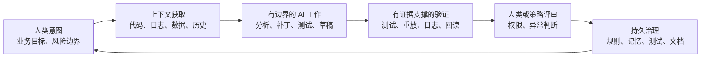
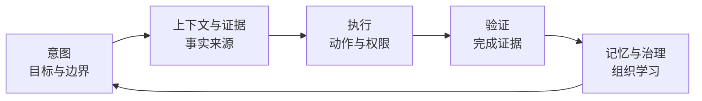
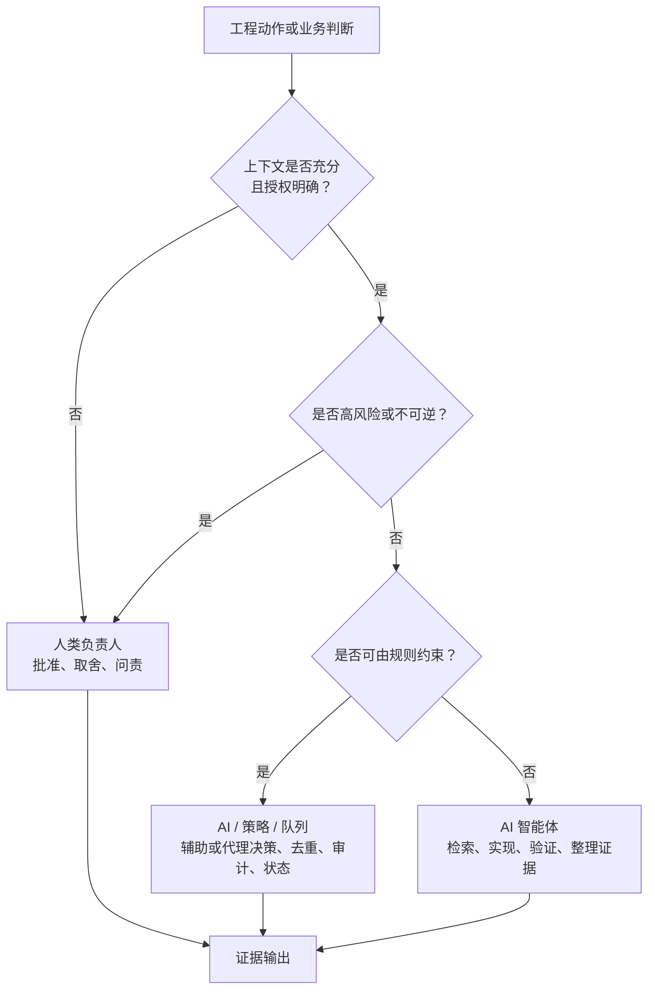
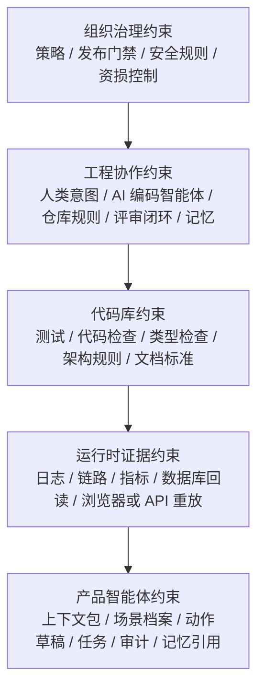
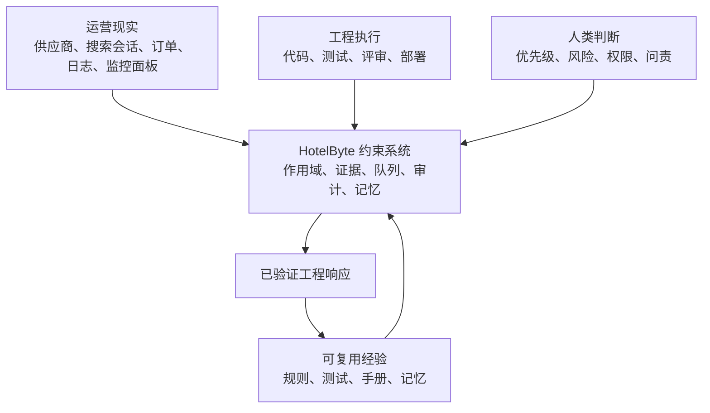
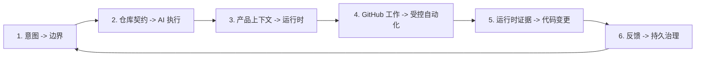

**面向人机协作软件交付的受治理操作模型 / 版本 1.0**


---

## 执行摘要

**适合读者：** 工程负责人、资深工程师、平台工程师和 AI 工具建设者。默认你已经理解现代软件交付，并且关心如何让 AI 参与工程工作但不失控。

**TL;DR：** 到 2026 年，AI 已经不只是编码便利工具。它正在进入问题分诊、代码修改、拉取请求评审、测试修复、事故分析、数据调查和发布准备。真正缺失的不是更多模型输出，而是一套受治理的操作系统：把人类判断、AI 执行、运行时证据、评审、记忆和发布控制接成同一条已验证反馈闭环。HotelByte 是这个模式的案例。

软件工程已经越过“AI 只是工作流边缘助手”的阶段。现代团队里，AI 可以检查仓库、起草补丁、总结日志、准备评审回复、编写测试，也可以在问题队列里执行常规工作。真正困难的问题已经从“模型能不能帮忙”，变成了“组织能不能安全吸收 AI 工作，同时不丢上下文、不丢权限边界、不丢生产事实”。

AI 原生工程组织不会只问：“哪个模型来写这个函数？”它会问：“人类和 AI 智能体之间，意图、上下文、代码、运行时证据、评审、部署、记忆和问责如何流动，才能既提升速度又不失控？”

本文提出 **AI 原生工程操作系统**：一种让人类负责人和 AI 智能体显式参与软件构建、运营和演进的社会-技术架构。它的中心不是模型自治，而是 **受治理的能动性**：每一次 AI 行动都必须扎根上下文、受权限边界约束、由证据验证，并回流为组织学习。

在这个系统中，人类拥有意图、判断、权限和问责；AI 智能体拥有高吞吐的发现、实现、验证、综合和常规闭环。连接两者的操作系统就是约束系统：项目规则、证据契约、角色路由、记忆、队列、评审门禁、运行时验证和审计轨迹。

HotelByte 展示了这个系统在生产导向工程组织里的形态。关键不是“在后端系统里加了 AI”，而是把 AI 工作拉进了和代码评审、事故响应、运行时证据、发布纪律、组织记忆同一套控制面里。

> **中心判断：** 下一阶段持久的工程优势，不来自让 AI 孤立地产出更多代码，而来自建立一套操作系统：AI 工作由人类意图定边界，由生产证据扎根，由评审和策略校验，并最终沉淀为组织学习。

---

## 从输出增长到受治理闭环

本章先定义问题，再给出原则。AI 原生工程不是把模型接进编辑器，而是把 AI 产出放进可追溯、可验证、可治理的反馈系统。

### 问题定义：AI 产出不等于工程能力

AI 参与工程之后，组织最容易误判的一点，是把“产出更多内容”当成“系统能力增强”。代码变多、回复变快、分析更长，并不自动意味着交付更可靠。

只追求输出的 AI 会优化局部产量，却不改变交付系统。典型失败模式包括：

- **提示词局部成功**：答案看起来正确，但没有扎根当前代码库或运行时。
- **上下文蒸发**：聊天中的决策没有沉淀为仓库规则、测试或运营记忆。
- **评审能力被挤压**：AI 产出代码的速度超过组织评审和验证能力。
- **无授权自动化**：智能体执行动作时没有明确人类或策略批准。
- **无治理记忆**：历史经验被复用，但没有新鲜度检查和来源问责。
- **无组织学习**：重复的人类纠偏没有改变未来 AI 行为。

这些不是单纯的模型质量问题，而是工程操作系统问题。组织要解决的不是“让 AI 再多写一点”，而是让 AI 工作进入可追溯、可验证、可治理的交付闭环。

---

### 核心原则：已验证反馈闭环

AI 原生工程的基本单位不是提示词、模型或智能体，而是 **已验证反馈闭环**。

更直接地说：**只有当 AI 工作能够从人类意图追溯到有证据支撑的完成，并继续回流为持久治理时，它才真正成为工程资产。**



当这个循环显式、可观测、受治理时，AI 才可靠。没有这个循环，AI 只是助手；有了这个循环，AI 才成为工程操作系统的一部分。

---

## 操作模型与权限边界

有了闭环原则之后，下一步是把它变成组织可以执行的结构：先拆成五个治理平面，再定义谁能在什么条件下做决定，最后让所有 AI 工作穿过工程控制面。

### 五个治理平面

操作模型需要把抽象原则拆成可执行结构。本文把 AI 原生工程操作系统拆成五个治理平面，对应一条完整工作链：定目标、取事实、做动作、验证结果、留下经验。



| 平面 | 回答的问题 | 承载内容 | 防止的失败 |
|---|---|---|---|
| 意图平面 | 人类真正要什么，哪些事不该做？ | 业务目标、风险容忍度、验收标准、截止时间、非目标、决策边界、问题单、评审线程、规格提案和显式纠偏。 | AI 把战略目标缩成一个方便但错误的局部补丁。 |
| 上下文与证据平面 | 判断所需的事实在哪里，是否可复查？ | 代码引用、测试输出、运行时日志、指标、数据库回读、接口响应、浏览器证据、历史决策、外部引用和记忆来源。 | AI 基于残缺上下文自信行动，或者把聊天记忆当成事实。 |
| 执行平面 | 谁可以做什么，动作边界在哪里？ | 角色路由、有作用域的智能体、任务归属、队列、去重键、隔离工作区、动作草稿、副作用边界和高风险排除规则。 | 自动化绕过权限、重复执行、扩大范围，或者把不可逆动作伪装成普通任务。 |
| 验证平面 | 什么才算完成？ | 单元测试、集成测试、端到端测试、代码检查、类型检查、构建、静态分析、接口重放、环境回读、评审闭环和发布门禁。 | 完成声明只来自模型自信，而不是来自与结论匹配的证据。 |
| 记忆与治理平面 | 这次经验如何改变下一次行为？ | 仓库内指令、评审规则、技能手册、问题单模板、架构记录、事故复盘、知识库、有作用域的记忆引用。 | 人类纠偏消失在聊天历史里，组织不断为同类问题重新付费。 |

| 设计判断 | 标准 |
|---|---|
| 少一个平面是否还能安全运行？ | 不能。少意图会跑偏，少证据会臆测，少执行边界会越权，少验证会虚假完成，少治理会重复犯错。 |
| 记忆和证据冲突时听谁的？ | 听当前证据。记忆用于加速定位，不能覆盖当前代码、当前运行时和当前人类判断。 |

---

### 权限模型：谁能在什么条件下决定

有了操作模型之后，下一步是定义权限。权限边界要按“谁在什么条件下拥有决定权”来读，而不是简单区分“人类决策、AI 执行”。上下文足够、授权明确、风险可控时，AI 可以参与业务目标和优先级判断，甚至代理低风险决策；高风险、不可逆、跨组织问责的判断仍应由人类负责人拥有。



| 决策类型 | 负责人 | 例子 | 控制方式 |
|---|---|---|---|
| 业务目标和优先级 | 人类负责人；AI 在上下文充分且授权明确时可辅助或代理低风险决策 | 先修复资损风险，还是先提升搜索体验；在明确策略下自动排序低风险问题单。 | 问题单、规格、评审意见、业务指标、授权策略、审计记录和明确纠偏。 |
| 风险容忍度和异常判断 | 人类负责人 | 是否接受临时降级、是否等待发布窗口、是否处理边缘供应商差异。 | 显式边界、升级规则和最终验收。 |
| 可逆的工程机械动作 | AI 智能体 | 检索代码、起草补丁、补测试、整理文档、准备评审回复。 | 仓库规则、作用域限制、测试和差异审查。 |
| 可审计的自动化流程 | 策略和队列系统 | 问题单去重、低风险任务排队、隔离工作区执行、状态记录。 | 幂等键、任务状态、审计日志和硬排除规则。 |
| 不可逆或高风险动作 | 人类负责人 | 生产变更、敏感数据操作、权限扩大、财务影响动作。 | 人类批准、发布门禁、运行时回读和事后记录。 |
| 组织学习 | 人类和 AI 共同维护 | 评审意见变成规则，事故经验变成手册，重复修复点变成测试。 | 仓库内治理文件、技能、记忆引用和架构记录。 |

| 组织创新 | 传统形态 | AI 原生形态 |
|---|---|---|
| 代码评审 | 一次性评论 | 未来规则、测试和技能的候选输入 |
| 事故复盘 | 事后报告 | 调试手册、验证路径和运行时证据模板 |
| 人类纠偏 | 聊天中的提醒 | 仓库规则、记忆、技能、队列策略 |
| AI 输出 | 补丁或回答 | 带权限边界和完成证据的工程动作 |

---

### 约束系统：把 AI 放进工程控制面

约束不是一个单点开关，而是一组从组织治理到运行时证据的控制面。AI 工作只有穿过这些控制面，才不会停留在孤立回答或孤立补丁。



| 层级 | 主要控制点 | 主要防线 |
|---|---|---|
| 组织治理约束 | 策略、发布门禁、安全规则、资损控制 | 保护权限和组织问责 |
| 工程协作约束 | 意图、仓库规则、评审闭环、记忆 | 控制 AI 如何进入代码协作 |
| 代码库约束 | 测试、检查、类型、架构规则、文档 | 防止补丁破坏工程质量 |
| 运行时证据约束 | 日志、链路、指标、数据回读、重放 | 防止“只看代码”的虚假自信 |
| 产品智能体约束 | 上下文、动作草稿、任务、审计、记忆 | 控制应用内 AI 行为 |

---

## HotelByte 案例：把 AI 放进生产交付系统

| 案例对象 | 为什么适合做 AI 原生工程案例 |
|---|---|
| HotelByte，酒店分销与运营平台 | 连接供应商、搜索、价格、预订、取消、支付、数据运营、客服支持和工程协作。在这样的系统里，工程判断通常要同时看运行时事实、业务风险和验证证据，不能只看代码差异。 |

| 常见输入面 | 具体信号 | 如果不进入同一条工作链路 |
|---|---|---|
| 产品与业务 | 产品意图、客服问题、资损边界、风险优先级 | AI 可能修了局部代码，却没有解决真实业务风险。 |
| 工程协作 | GitHub 问题单、拉取请求、评审意见、发布目标 | AI 可能回复了评审，却没有闭合真实路径。 |
| 供应商与订单 | 供应商契约、搜索会话、订单状态、取消规则、支付状态 | AI 可能误解领域事实，生成危险补丁。 |
| 运行时现场 | 日志、监控面板、数据库回读、接口重放、测试环境或生产环境证据 | AI 可能只基于代码推理，错过线上真实行为。 |
| 人类判断 | 当前哪个风险最重要、哪些动作不可逆、何时需要升级 | AI 可能越权，或者把高风险动作当普通任务处理。 |

HotelByte 的约束系统把这些输入汇入三层控制面：



| 闭环步骤 | 人类负责人 | AI 智能体 | 完成证据 |
|---|---|---|---|
| 1. 界定风险 | 定义目标、边界和错误后果 | 复述目标，标出不确定点 | 明确的任务范围和非目标 |
| 2. 扎根现场 | 指定关键风险或约束 | 收集代码、日志、会话、接口、数据库和历史决策 | 可引用的证据集合 |
| 3. 完成变更 | 保留权限和取舍判断 | 修改代码、补测试、更新文档、准备评审回复 | 差异、测试输出、文档变更 |
| 4. 证明结论 | 判断证据是否足够 | 运行验证，整理结论与限制 | 与结论类型匹配的证明 |
| 5. 留下经验 | 决定哪些经验要沉淀 | 写入规则、记忆、技能、测试或架构记录 | 可复用的工程资产 |

| 案例结论 | 含义 |
|---|---|
| HotelByte 的价值不在“更多自动化” | 价值在缩短生产信号到已验证工程响应之间的距离。 |
| 有效抽象不是“会写代码的智能体” | 有效抽象是受治理闭环：生产症状 -> 证据 -> 实现 -> 验证 -> 可复用经验。 |
| 不需要用虚构效率数字证明价值 | 价值体现在结构变化：意图、证据、变更、验证和学习之间的交接变少。 |

### 为什么 HotelByte 能做这件事

| 能力来源 | HotelByte 已经具备的基础 | 对 AI harness 的意义 |
|---|---|---|
| 高密度运行时事实 | 供应商差异、价格库存变化、搜索链路、订单状态、取消规则、支付正确性、客服解释、资损风险。 | AI 不能停在生成补丁，必须接入日志、会话、数据库、接口响应、监控窗口和发布状态。 |
| 可沉淀工程纪律 | 问题单、拉取请求、代码评审、发布门禁、测试命令、规格文档、仓库内指令、领域技能、事故排查手册。 | AI 不需要另起流程，而是进入已有工程结构，穿过同样的边界、证据和评审。 |
| 人机分工经验 | 人类给出目标、优先级、风险判断和权限边界；AI 承担检索、实现、验证、文档和证据整理。 | 反复纠偏可以转化为规则、记忆、技能、测试和流程，形成组织学习。 |

这些基础让 HotelByte 的实践不只是“接入一个模型”。更关键的变化，是模型能力、仓库规则、运行时证据和人类权限被放进同一套工作系统。创新也发生在这个连接层。

### 真正的创新在哪里

创新不在某一个单点组件，而在集成方式：把代码评审、测试、日志、问题单、队列、记忆和手册组织成 AI 可参与、可审计、可验证、可学习的操作结构。

| 创新点 | 改变了什么 | 为什么重要 |
|---|---|---|
| 证据耦合的智能体工作 | AI 行动从一开始就要求连接代码、日志、会话、接口、数据和测试，而不是只基于提示词生成答案。 | 让 AI 能处理生产系统里的真实歧义，而不是只优化局部代码输出。 |
| 仓库可见治理 | 项目指令、评审规则、技能、规格和测试进入仓库或工程资产，而不是留在聊天窗口。 | 让组织标准可以被版本化、评审、复用，并约束未来智能体。 |
| 人机权限分层 | 人类拥有目标、风险、不可逆动作和最终问责；AI 拥有可逆机械动作和证据整理。 | 防止 AI 过度自治，也防止人类沦为低效命令执行器。 |
| 运行时到代码的反馈闭环 | 事故、日志、会话、接口重放、数据库回读和发布门禁可以直接塑造代码变更和最终报告。 | 把“线上发生了什么”变成工程输入，而不是事后解释材料。 |
| 记忆作为受治理基础设施 | 记忆用于加速定位，但必须带来源、新鲜度和作用域，且不能压过当前证据。 | 让经验复利，同时避免陈旧经验污染判断。 |
| 问题单和拉取请求自动化通道 | AI 进入 GitHub 工作流时带队列、去重、范围、审计和高风险排除。 | 从“AI 能写补丁”提升到“AI 能参与受治理的工程工作流”。 |

这些做法不需要宣称“全球首创”才有价值。到 2026 年，业界已经普遍承认 AI 会进入代码评审、问题修复和工程自动化；真正走在前沿的，是能否把这些能力放进一套可审计、可验证、可学习的组织系统里。

### HotelByte 约束系统剖面

这个案例的技术形态，是六个相互连接的闭环。



#### 1. 从人类意图到工程边界

工作通常从产品需求、GitHub 问题单、代码评审意见、事故症状、发布目标或运营问题开始。约束系统不把它们当成普通提示词，而是转成有边界的工程工作：

- 人类意图定义目标结果和风险边界；
- 产品规格或问题单产物保留验收上下文；
- 项目指令定义自治范围、升级规则、验证要求和提交规则；
- 评审规则定义 AI 修改代码前必须满足的质量线；
- 记忆和知识文件告诉 AI 应先看哪里。

例如，代码评审里看到的可能只是一个价格字段为空的补丁问题，但工程边界会迫使 AI 回到更完整的目标：这个空值来自供应商库存、汇率转换、税费解析、订单取消规则，还是资损保护逻辑。修复点不一定在评审意见所在的那一行代码里。

#### 2. 从仓库契约到 AI 执行

仓库给 AI 编码智能体一份操作契约：

- 项目知识提供系统地图、后端手册、测试指引、业务核心上下文和事故入口；
- 工作流技能把重复工作沉淀成运行时日志排查、测试环境验证、发布和数据迁移、供应商映射、智能体流程治理等可复用流程；
- 角色提示词定义架构师、执行者、验证者、评审者、调试者、写作者和领域专家等有边界角色；
- 仓库可见的评审规则把人类标准变成策略；
- 持续集成流程和测试命令成为验证门禁，而不是可选后续动作。

因此 AI 智能体不是“在使用仓库”，而是在一个由仓库定义的契约内工作。

#### 3. 从产品上下文到智能体运行时

在产品内部，运营页面和自动化通道会进入共享的智能体运行时：

```text
会话 / 日志 / 监控面板 / 订单 / 供应商 / 问题单 / 拉取请求
  -> 标准化作用域
  -> 证据引用
  -> 场景路由
  -> 智能体运行
  -> 消息 / 动作 / 任务 / 审计
```

这里是产品智能体约束和工程协作约束的交汇点。一个运行时事故可以继续变成客服答复、重放任务、代码排查动作、数据产物、问题修复或拉取请求评审路径，而不需要每条工作流重新发明身份、证据和审计。

#### 4. GitHub 工作的受控自动化

GitHub 问题单和拉取请求工作流不是普通模型提示词，而是受控自动化通道：

- 问题单自动化只选择合格工作，排除高风险类别，按问题单、事故簇和依赖族去重，排队任务，在隔离工作区执行，并记录任务状态；
- 拉取请求评审绑定仓库、拉取请求编号和代码版本，读取人类评审上下文，限制差异范围，带显式标签发布 AI 生成评审，并可通过队列交接修复工作；
- 两条路径都复用作用域、任务、审计、记忆、证据等运行时概念。

这就是“AI 能写补丁”和“AI 能进入受治理工程工作流”的区别。

#### 5. 运行时证据回到代码变更

HotelByte 的业务领域决定了“只看代码”的信心不够。供应商行为、搜索会话、日志、监控窗口、订单状态、数据读模型、测试环境和生产环境差异，经常共同决定正确性。因此约束系统要求使用能够证明结论的最小证据闭环：

- 确定性的代码行为用测试证明；
- 接口契约行为用接口重放或端到端验证证明；
- 事故行为用日志、链路追踪和会话证据证明；
- 数据事实用数据库或时序数据库回读证明；
- 前端和运营工作流用浏览器检查证明；
- 已部署状态相关问题用发布门禁证明。

AI 编码智能体的最终回复应携带这些证据，让人类负责人基于事实判断，而不是基于模型自信判断。

#### 6. 反馈进入持久治理

最后一环不是“写一条总结”，而是把反馈变成下一次会被系统自动使用的工程资产。

| 反馈资产 | 技术落点 | 下一次如何生效 | 业务结果 |
|---|---|---|---|
| 评审规则 | 仓库可见的 review rule、AGENTS 指令或质量门禁 | AI 修改代码前读取规则；代码评审或自检时按规则阻断错误模式 | 重复评审意见减少，资损、兼容性和安全类错误更早暴露 |
| 知识库条目 | 项目知识文件、架构地图、领域说明、故障入口 | AI 先检索这些入口，再进入代码和日志；减少从零摸索 | 定位时间缩短，事故和供应商问题更快进入正确路径 |
| 工作流技能 | 可复用 skill / runbook / 脚本化检查流程 | 类似问题触发同一排查顺序、命令、证据要求和升级规则 | 运行时排查结果更稳定，不依赖某个工程师临场记忆 |
| 架构或产品决策 | OpenSpec、ADR、产品规格或发布规则 | 后续变更必须对齐已记录的取舍和非目标 | 避免反复讨论同一方向，减少跨团队理解偏差 |
| 回归测试 | 单元测试、集成测试、端到端测试、接口重放、数据校验 | CI、发布门禁或本地验证会自动拦截旧问题复发 | 把一次事故或评审纠偏转化为长期质量保护 |
| 作用域记忆 | 带来源、时间和适用范围的记忆引用 | AI 用它加速定位，但必须被当前证据确认 | 经验可复用，同时避免陈旧经验压过当前事实 |

技术支撑的关键，是这些资产都能被工作流重新加载：规则进入提示和评审门禁，技能进入任务路由，测试进入 CI 和发布门禁，知识进入检索上下文，记忆进入带来源的假设集合。业务结果不是“文档变多”，而是同类问题的定位、修复、验证和评审成本下降。

### 案例完整性地图

| 操作问题 | HotelByte 的回答 | 意义 |
|---|---|---|
| 谁定义真实目标？ | 人类负责人、问题单、代码评审意见、事故和发布目标定义结果与风险边界。 | AI 工作始终锚定业务和运营结果。 |
| 协作如何被治理？ | 项目指令、产品规格、评审规则、可复用工作流和有作用域的记忆定义工作契约。 | 规则跟随项目长期存在，而不是消失在聊天记录里。 |
| AI 应该负责什么？ | 检索、实现、测试、文档、评审跟进和证据摘要。 | AI 加速执行，但不接管最终权限。 |
| 产品运行时里什么必须显式？ | 作用域、证据、动作草稿、后台任务、审计和记忆引用。 | 产品内智能体保持可检查、可治理。 |
| 领域决策从哪里进入？ | 客服、验证、数据运营、供应商运营、问题修复和拉取请求评审各有边界明确的通道。 | 不同工作类型有不同控制，而不是一个万能智能体。 |
| 正确性如何证明？ | 根据结论类型选择测试、接口重放、日志、会话、监控面板、数据库回读、测试环境检查和发布门禁。 | 用与结论匹配的证据替代“只看代码”的信心。 |
| 系统如何学习？ | 重复纠偏变成规则、工作流、知识、规格、测试或记忆。 | 人类纠偏会复利到未来 AI 行为。 |

真正的启示很简单：约束系统只有能穿过真实歧义、真实事故、真实评审和真实发布压力时，才有意义。

---

## 从案例到组织化采用

案例之后，关键问题不再是“能不能做一个 agent”，而是组织如何判断自己处在哪个阶段、该看哪些运营指标，以及按什么顺序推进。

### 成熟度模型

| 阶段 | 描述 | 失败模式 |
|---|---|---|
| 0. 临时使用 AI | 工程师手动使用聊天工具 | 没有持久上下文或治理 |
| 1. 辅助编码 | AI 写局部代码片段 | 输出增长快于验证 |
| 2. 仓库感知智能体 | AI 能检查并修改仓库 | 对运行时事实和评审闭环仍弱 |
| 3. 已验证智能体闭环 | AI 运行测试并报告证据 | 学习仍困在单次会话 |
| 4. 受治理约束系统 | 规则、记忆、评审、队列、副作用控制显式 | 需要作为工程资产维护 |
| 5. AI 原生工程操作系统 | 人机闭环持续更新代码、测试、文档、运行时控制和治理 | 主要风险转向组织设计和权限边界 |

多数组织处在第 1 阶段到第 3 阶段之间。战略机会在第 5 阶段。

---

### 运营指标

传统工程指标仍重要，但 AI 原生系统需要额外指标：

- **上下文获取时间**：AI 智能体多快能收集足够扎实证据开始行动。
- **证据覆盖率**：AI 结论中有多少被代码、测试、日志或运行时数据支撑。
- **已验证变更延迟**：从人类意图到已测试、可评审变更的时间。
- **评审闭环率**：评审意见中有多少通过代码、测试和回复闭环。
- **记忆转化率**：重复纠偏中有多少沉淀为持久规则或文档。
- **自动化逃逸率**：智能体动作绕过预期确认或验证的次数。
- **人类判断负载**：人类时间花在决策上还是机械执行上。

目标不是“更多 AI 输出”，而是更快的已验证学习和更低的运营风险。

---

### 采用路线

1. **明确组织权限契约**：写清 AI 可以决定什么、人类拥有什么、什么需要批准。
2. **强制证据化**：完成声明必须有代码引用、测试、日志或运行时证明。
3. **创建仓库可见规则**：把重复纠偏从聊天沉淀到文档、评审规则、技能和测试。
4. **引入有作用域的智能体**：将探索、实现、评审、验证、写作路由到不同角色。
5. **增加队列和去重**：防止问题单、拉取请求、事故、依赖失败上重复智能体工作。
6. **闭合运行时循环**：当正确性依赖运行时行为时，把代码变更连接到测试环境或生产环境证据。
7. **治理记忆**：记忆用于加速，而不是覆盖新鲜证据。
8. **度量已验证学习**：优化有证据支撑的闭环，而不是原始输出量。

---

## 风险边界与反模式

AI 原生工程操作系统不是越重越好，也不是越自治越好。本章把适用边界和常见误区放在一起，避免把治理系统做成新的仪式负担。

### 取舍与限制

这个操作系统模型比聊天工具或本地编码助手更重。它需要项目规则、证据纪律、评审卫生、记忆维护和清晰的权限边界。团队不应该把它套到每个脚本、原型或低风险内部工具上。

当错误成本很高时，它才值得：生产事故、资损正确性、合规、供应商集成、面向客户的工作流、运营数据，或者评审压力很大的工程组织。在这些场景里，这些开销不是仪式感，而是让 AI 速度不变成失控风险的控制面。

---

### 反模式

#### 把提示词当流程

如果唯一流程是“把提示词写好”，组织就没有操作系统。提示词质量很重要，但不能替代测试、评审门禁、运行时证据或记忆。

#### 自动化剧场

看似自治、实则需要人类不断清理的智能体，不是自动化，只是把工作从敲代码转移到了监督。

#### 无来源记忆

无来源记忆会制造虚假权威。每条持久记忆都应该有来源链接、作用域限制，或被当作假设。

#### 事后才想起评审

如果 AI 增加代码量，却没有增加评审和验证能力，交付风险会上升。

#### 把人类变成命令执行器

如果人类大部分时间都在告诉 AI 下一条命令怎么跑，说明约束系统不成熟。AI 应负责可逆机械动作；人类应负责判断。

## 结论

软件工程中最高杠杆的 AI 转型不是代码生成，而是建立一个操作系统，让人类和 AI 智能体安全地共享理解、修改、验证和演进软件的工作。

这个操作系统需要约束：意图、上下文、执行、验证、记忆和治理。没有它们，AI 只是强大的局部工具；有了它们，AI 才成为组织工程神经系统的一部分。

HotelByte 展示的是更大的模式：AI 的价值不在于被接到代码编辑器旁边，而在于被嵌入一套受治理的工程工作操作系统。

---

## 附录：行业对齐与延伸阅读

以下材料说明这条路线并不是孤立实践。基模公司、代码托管平台、编辑器和 agent 产品正在收敛到同一方向：AI 进入带工具、权限、队列、记忆、审计和企业控制面的工程工作系统。

### 行业对齐地图

头部基模公司和 agent 公司正在收敛到同一个方向：AI 不再只是代码补全或聊天窗口，而是进入带工具、权限、队列、记忆、审计和企业控制面的工程工作系统。

| 阵营 | 代表动向 | 对本文的启示 |
|---|---|---|
| OpenAI | Codex 从云端编码智能体扩展到 GPT-5.3-Codex、Codex App、CLI、IDE、Web 和 workspace agents。重点从“写代码”转向长任务、并行工作、团队权限、企业监控和安全治理。 | AI 工程能力正在平台化；关键问题变成如何管理多个长期运行的智能体。 |
| Anthropic | Claude Code 从终端工具扩展到 IDE、Web、Team/Enterprise 管理、Agent SDK、subagents、hooks、checkpoints 和企业合规 API。Anthropic 还开始量化真实使用中的 agent autonomy。 | “人类控制”和“智能体自治”需要产品化的权限、检查点和可观测性。 |
| Google | Jules、Gemini CLI、Gemini Code Assist、subagents、Antigravity CLI 等产品线把 Gemini 推向异步编码、终端智能体、IDE/云工作流和多子智能体协作。 | 基模能力正在和开发工具链、云平台、子智能体编排合并。 |
| Kimi / Moonshot AI | Kimi Agent 和 Kimi K2/K2.5/K2 系列把开源模型、长上下文、工具调用、Agentic Coding 和多智能体能力作为核心卖点。 | 中国头部模型也在把“Agent 能力”作为模型代际能力，而不是外部插件。 |
| 智谱 / Z.ai | GLM-4.6 明确定位为 agentic、reasoning、coding 能力模型，并进入 Claude Code、Cline、Roo Code 等 coding agents。 | 开源/开放模型正在成为 agent harness 的可替换执行层。 |
| DeepSeek | DeepSeek API 提供 OpenAI/Anthropic 兼容接口，官方文档强调可直接作为 Claude Code、GitHub Copilot、OpenCode 等 agent/coding assistant 的后端模型，并持续强化工具调用和 agent 训练数据。 | 模型层正在标准化为 agent 工具链的可插拔算力层。 |
| Cursor | Cursor 从 AI 编辑器演进到 Composer、Background Agent、BugBot、Memories、MCP、Subagents、Skills 和 agent window。 | 头部 agent 公司正在把编辑器变成多智能体工程操作台。 |
| GitHub Copilot | Copilot 推出 agent mode、asynchronous coding agent、GitHub 原生任务派发和 Agentic DevOps loop。 | 代码托管平台正在把 issue、PR、CI 和 agent 执行连接成闭环。 |
| Cognition Devin | Devin 将自己定位为 autonomous software engineer，让工程师更像架构师，agent 承担重复工程工作。 | 市场叙事已经从“辅助写代码”转向“重新分配工程劳动”。 |

这张地图说明：HotelByte 的 harness 不是孤立实践，而是对行业主线的工程化回应。头部公司在争夺模型、IDE、终端、云端任务、代码托管和企业控制面；真正长期可复用的能力，是把这些组件组织成受治理的工程操作系统。

---

### 延伸阅读

#### 基模公司与模型平台

- [OpenAI: Introducing GPT-5.3-Codex](https://openai.com/index/introducing-gpt-5-3-codex/)：Codex 从编码智能体走向通用计算机工作智能体，覆盖长任务、工具使用、前端构建、知识工作和安全治理。
- [OpenAI: Introducing workspace agents in ChatGPT](https://openai.com/index/introducing-workspace-agents-in-chatgpt/)：团队级共享智能体，强调组织权限、企业监控、工具和记忆。
- [Anthropic: Claude Code overview](https://docs.anthropic.com/en/docs/claude-code/overview)：Claude Code 作为终端内 agentic coding 工具，覆盖代码修改、命令执行、CI 自动化和 MCP 外部数据源。
- [Anthropic: Enabling Claude Code to work more autonomously](https://www.anthropic.com/news/enabling-claude-code-to-work-more-autonomously)：Claude Code 的 IDE、Agent SDK、subagents、hooks、checkpoints 和权限框架。
- [Anthropic: Measuring AI agent autonomy in practice](https://www.anthropic.com/research/measuring-agent-autonomy)：基于 Claude Code 和 API 使用数据，分析真实世界中用户如何授予智能体自治权。
- [Google: Build with Jules, your asynchronous coding agent](https://blog.google/technology/google-labs/jules)：Google 对异步编码智能体的产品化入口。
- [Google: Gemini CLI, your open-source AI agent](https://blog.google/innovation-and-ai/technology/developers-tools/introducing-gemini-cli-open-source-ai-agent/)：Google 将 Gemini 带入终端、开发任务和自动化工作流。
- [Google Developers: Subagents have arrived in Gemini CLI](https://developers.googleblog.com/en/subagents-have-arrived-in-gemini-cli/)：Gemini CLI 将单智能体扩展为可定制子智能体体系。
- [Kimi: Kimi Agent 模式](https://www.kimi.com/zh-cn/help/agent/agent-overview)：Kimi 将 Agent 模式与 K2/K2.5 的自主编程、工具调用和推理能力绑定。
- [Moonshot AI](https://www.moonshot.ai/en)：Moonshot 官方产品线显示 Kimi K2.5、Agent Swarm、WorldVQA 等 agent 方向。
- [Z.ai: GLM-4.6: Advanced Agentic, Reasoning and Coding Capabilities](https://z.ai/blog/glm-4.6)：GLM-4.6 作为 agentic、reasoning、coding 模型，并进入多种 coding agent 工具链。
- [DeepSeek API Docs](https://api-docs.deepseek.com/)：DeepSeek API 的 OpenAI/Anthropic 兼容接口和 agent/coding assistant 集成路径。

#### Agent 产品与工程平台

- [Cursor: BugBot, Background Agent, Memories, MCP](https://cursor.com/en/changelog/1-0)：Cursor 将代码评审、后台智能体、记忆和 MCP 作为编辑器内 agent 基础设施。
- [Cursor: Introducing Composer 2](https://cursor.com/blog/composer-2)：Cursor 在自有编码模型和 agent harness 上继续推进复杂任务能力。
- [GitHub: Coding agent for GitHub Copilot](https://github.com/newsroom/press-releases/coding-agent-for-github-copilot)：GitHub 将异步 coding agent 嵌入 issue、PR、VS Code 和 Agentic DevOps loop。
- [Cognition](https://cognition.ai/)：Devin 将“autonomous software engineer”定位为让工程师更像架构师、由智能体承担重复工程工作。
- [Sonar: Agent Centric Development Cycle](https://www.sonarsource.com/company/press-releases/sonar-introduces-the-agent-centric-development-cycle/)：把智能体开发视为生命周期、质量和验证问题，而不只是代码生成问题。
- [Microsoft Engineering: Enhancing Code Quality at Scale with AI-Powered Code Reviews](https://devblogs.microsoft.com/engineering-at-microsoft/enhancing-code-quality-at-scale-with-ai-powered-code-reviews)：来自生产工程团队的 AI 辅助拉取请求评审实践，重点是信任与反馈循环。

#### 实证研究

- [AIDev: Studying AI Coding Agents on GitHub](https://arxiv.org/abs/2602.09185)：汇总 OpenAI Codex、Devin、GitHub Copilot、Cursor、Claude Code 等 agentic PR 数据。
- [Agentic Much? Adoption of Coding Agents on GitHub](https://arxiv.org/abs/2601.18341)：研究 coding agents 在 GitHub 上如何快速从补全工具演化为可生成完整 PR 的实践工具。
- [Where Do AI Coding Agents Fail?](https://arxiv.org/abs/2601.15195)：关于智能体提交拉取请求、合并结果、持续集成结果和评审动态的实证研究。
- [Human-AI Synergy in Agentic Code Review](https://arxiv.org/abs/2603.15911)：研究 AI 智能体如何进入代码评审，以及为什么人机交互设计会影响评审质量。

---

*本文面向正在设计持久人类-AI 软件交付系统的工程领导者、架构师和 AI 平台建设者。*
