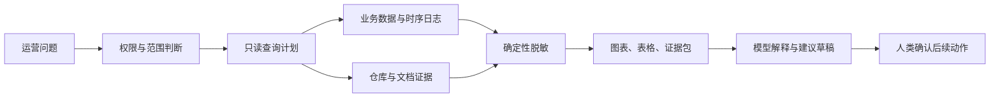
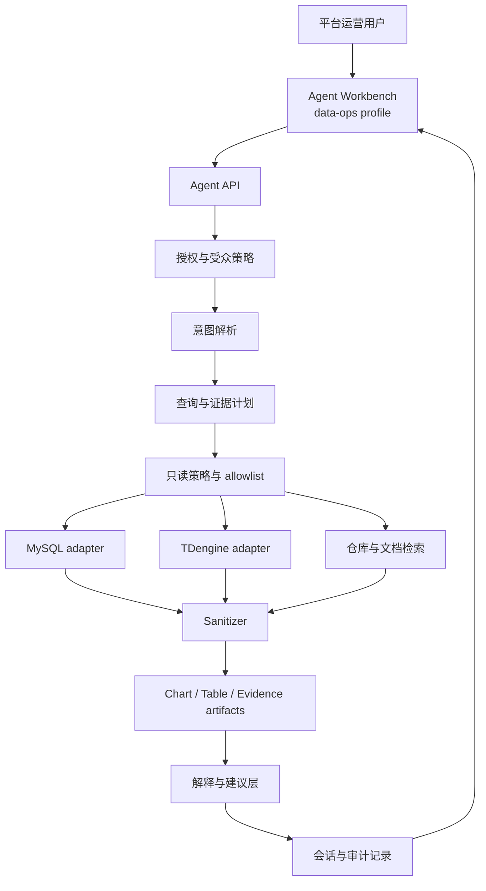

  <strong>阅读路径：</strong>这是 WP26 完整白皮书。若需要更短的读者入口，请先阅读 <a href="/zh/whitepapers/wp26-data-agent-operational-intelligence/">博客导读</a>。也可以浏览 <a href="/zh/whitepapers/">HotelByte 白皮书索引</a>。

# 面向运营智能的受治理数据智能体

英文版本：[../26-data-agent-governed-operational-intelligence.md](../26-data-agent-governed-operational-intelligence.md)

---

## 执行摘要

**适合读者：** 数据平台负责人、工程负责人、平台运营团队、安全审核方，以及正在评估企业级数据智能体的技术决策者。默认你已经理解数据权限、运营分析和生产系统排障的基本约束，并且关心如何让 AI 参与数据调查但不越权。

**TL;DR：** HotelByte Data Agent 不是一个把自然语言直接翻译成 SQL 的聊天窗口。它是一套受治理的运营调查层：把平台用户的问题转成有边界的查询意图，连接 MySQL 业务状态、TDengine 时序日志和仓库内业务规则，在后端完成权限、只读计划、数据脱敏、可视化 artifact 和审计记录，再让模型解释证据、提出人类可确认的建议。

酒店运营问题很少只存在于一张报表里。一个供应商的 `hotelRates` 错误率突然升高，原因可能在供应商接口行为、凭证状态、房型映射、订单状态、价格规则、运行时日志或最近一次发布里。传统 dashboard 可以显示异常，但通常无法解释异常为什么发生，也无法告诉运营人员应该先查凭证、供应商契约、代码路径还是某个 trace 范围。

Data Agent 的核心价值，是把“问题”变成“可复查的证据包”。它先确定提问者是否有权限，再选择允许访问的数据源，生成只读查询计划，读取保留期内的时序与业务数据，附加仓库和文档证据，对敏感字段做确定性脱敏，最后返回图表、表格、证据引用和建议草稿。模型参与解释，但不拥有数据库权限、脱敏规则或最终动作权。

这份白皮书说明 HotelByte 如何把 Data Agent 放进平台运营控制面，而不是把它做成一个无边界 SQL 控制台。中心不是“让 AI 更会查数”，而是 **让数据调查形成受治理闭环**：问题有授权，事实有来源，查询有边界，结果可视化，敏感信息默认脱敏，建议必须由人类确认，过程可以审计。

> **中心判断：** 企业级数据智能体的竞争力不来自模型能否写出更复杂的 SQL，而来自它能否在权限、证据、脱敏、可视化、审计和人类确认之间形成一条可验证的运营调查链路。

## 问题定义：为什么这不是普通功能

面向运营智能的受治理数据智能体 不应被当成一个孤立功能来读。在酒店分销系统里，Data Intelligence 通常同时连接供应商差异、租户边界、运行时证据、客户体验和外部审计。真正的问题不是“有没有这个组件”，而是它在生产压力下是否仍然可解释、可验证、可治理。

---

## 从 Dashboard 到证据包

传统运营分析工具通常分成三类：dashboard、SQL 控制台和聊天机器人。Dashboard 适合已知问题，SQL 控制台适合专家自由探索，聊天机器人适合总结和问答。但在生产平台里，真实运营问题经常跨越这三者：既需要数据聚合，也需要业务规则解释，还需要权限、脱敏和审计。

Data Agent 解决的是这类中间地带。用户不从表名开始，而从运营问题开始：

> 过去 24 小时，哪个供应商的 hotelRates 错误率最高？请按请求量归一化，并说明是否像供应商行为变化、凭证问题、映射问题还是业务规则不匹配。

一个可用的企业级回答不能只给出一段文字。它应该同时包含：

- 查询意图和时间窗口。
- 涉及的数据源和字段边界。
- 图表或表格形式的结果 artifact。
- 被脱敏后的样本或聚合数据。
- 与解释相关的代码路径或文档证据。
- 数据缺口和不确定性。
- 需要人类确认的后续建议。

这就是 Data Agent 和普通聊天机器人的区别：它不是“回答问题”，而是组织一次可复查的运营调查。

---

## 操作模型：受治理的数据调查闭环

Data Agent 的基本单位不是 prompt，也不是 SQL，而是一次受治理的数据调查闭环。

| 阶段 | 需要回答的问题 | HotelByte 的控制方式 |
|---|---|---|
| 意图 | 用户到底要调查什么？范围、时间窗口、对象和输出形态是什么？ | 意图解析器提取 source、time window、supplier/order/trace/session filter、输出类型和安全要求。 |
| 授权 | 提问者是否有权访问这个分析面？ | 仅 platform 用户可访问 `data-ops` profile，后端授权仍是最终边界。 |
| 计划 | 查询是否只读、有限、可解释？ | 查询计划声明 adapter、schema、columns、filters、grouping、limit 和 sanitizer requirement。 |
| 取证 | 哪些事实支撑结论？ | MySQL 读取业务状态，TDengine 读取日志和聚合，仓库检索业务规则和文档。 |
| 脱敏 | 结果是否会暴露凭证、PII、商业字段或运营标识？ | 后端 sanitizer 在模型和浏览器渲染前做确定性脱敏。 |
| 呈现 | 人类如何快速判断结果？ | 返回 typed chart、table、evidence artifact，而不是只返回 prose。 |
| 建议 | 下一步是否自动执行？ | 建议是草稿，运营动作仍由人类确认。 |
| 审计 | 事后能否复盘？ | 记录 prompt、scope、权限决策、计划、adapter、脱敏类别、artifact 和建议。 |

这个闭环让 Data Agent 保持在“调查助手”位置：它加速定位和解释，但不绕过平台的数据权限、运营判断和变更控制。

---

## 架构剖面

Data Agent 被放在既有 Agent Workbench 中，以 `data-ops` profile 提供给平台运营角色。前端只负责采集问题、展示会话、图表和结果；权限、查询计划、数据读取、脱敏和 artifact 构建都在后端完成。

### 意图解析器

意图解析器把自然语言问题转换成结构化调查意图，包括数据源、时间窗口、过滤条件、输出类型、聚合形态和安全要求。它的职责不是生成任意 SQL，而是把模糊问题变成后续计划器可以验证的调查请求。

### 查询与证据计划器

计划器生成有边界的读取计划。每个计划必须声明 source adapter、允许访问的 schema、字段、过滤条件、分组方式、行数上限和需要应用的脱敏类别。SQL 或 TDengine 查询只能从已通过策略校验的计划生成。

### 数据源 adapter

MySQL adapter 读取订单、供应商、凭证、映射、钱包和配置等持久业务实体。TDengine adapter 读取请求日志和时序聚合，并要求强制时间窗口和聚合优先形态。仓库 adapter 读取代码和文档证据，帮助解释状态机、供应商降级、凭证策略、映射逻辑和业务规则。

当前已经验证的行为包括：

- TDengine UAT 读取路径曾返回最近一天 `hotelRates` / `rateCount` 聚合的真实 `hb_log` 行。
- MySQL 源清单识别出部署差异：所检查 UAT 后端连接 `hoteldev`，其中 `supplier_daily_snapshot` 缺失，遗留 `inventory_quality_daily_supplier_snapshot` 只有 `2026-04-25` 数据。
- 供应商可靠性路径不再探测 MySQL snapshot 候选表；它保留 TDengine `hblog_ns.hb_log_supplier_reliability_daily` 作为历史供应商 SLA 来源，并用 `hblog_ns.hb_log` 做保留期内原始 drilldown。
- 前端只渲染后端返回的 `data_ops_result` artifact；没有 artifact 时显示空态，不渲染静态样例数据。

### 脱敏与 artifact 构建

原始数据不会直接进入模型上下文或浏览器结果表。系统先把数据规范化为 typed frame，再应用 sanitizer，最后生成 chart series、masked table、evidence reference、SQL intent summary 和 recommendation draft。模型解释 artifact，但不定义 artifact schema，也不能决定秘密是否可见。

---

## 治理控制摘要

| 控制 | 用户价值 |
|---|---|
| 平台用户专属入口 | 将跨租户运营分析限制在授权平台角色内。 |
| 后端授权边界 | 防止前端菜单可见性成为最终安全边界。 |
| 只读查询计划 | 降低自然语言生成查询误触生产写入的风险。 |
| 数据源与 schema allowlist | 把调查限制在已批准的运营数据域内。 |
| 默认敏感数据脱敏 | 保护凭证、token、PII、商业字段、订单和 trace 标识。 |
| 仓库证据引用 | 让解释回到真实业务规则，而不是泛化推断。 |
| Typed chart/table artifact | 让结果可确定渲染、可回读、可审查。 |
| 多轮上下文保留 | 支持运营人员继续缩小时间窗口、供应商和 trace 范围。 |
| 人类确认建议 | 保留运营判断和动作控制权。 |
| prompt、计划和 artifact 审计 | 支持事故复盘、合规检查和模型输出问责。 |

---

## 安全失败模式

Data Agent 的失败策略是 fail closed：

- 权限缺失或不明确时拒绝访问。
- 不安全 SQL 在执行前被拒绝。
- 未分类敏感字段默认抑制或脱敏。
- 无边界时序查询被拒绝。
- 仓库检索失败被报告为证据缺口，而不是由模型猜测补齐。
- 建议保持草稿状态，直到人类确认运营动作。

这个设计把模型放在证据解释层，而不是权限或数据执行层。模型可以要求更窄范围、解释 artifact、提出假设和建议，但不能绕过 adapter、allowlist、脱敏或人类确认。

---

## 验证模型

外部审核方可以从以下路径验证 Data Agent：

- 路由和受众检查。
- profile 可见性检查。
- 查询计划结构检查。
- 只读 adapter 测试。
- schema allowlist 测试。
- sanitizer 测试向量。
- chart/table artifact schema 校验。
- 审计日志完整性检查。
- 非平台用户拒绝测试。

完成声明必须匹配证据类型。比如“查询是只读的”要有 DML 拒绝和 adapter 权限证据；“结果已脱敏”要有 sanitizer 测试；“前端展示真实结果”要能证明它只渲染后端 artifact，而不是静态样例。

---

## 与传统方案的区别

| 方案 | 优点 | 局限 |
|---|---|---|
| Dashboard | 对已知指标很快，适合固定监控。 | 难以解释新问题，也难跨越代码、日志和业务状态。 |
| SQL 控制台 | 灵活，适合专家探索。 | 权限、脱敏、审计和误操作风险高。 |
| 通用聊天机器人 | 善于总结和追问。 | 缺少数据权限、查询边界、脱敏和实现证据。 |
| HotelByte Data Agent | 同时提供数据读取、仓库证据、可视化 artifact、脱敏和审计。 | 必须维护 source catalog、schema allowlist 和 sanitizer 规则；覆盖范围应逐步扩展。 |

Data Agent 的方向不是替代运营人员，而是压缩从问题到证据支撑行动的距离。它让运营人员更快看到事实、风险和下一步选择，同时把权限和最终判断留在人类与平台策略手里。

---

## 权威参考映射

| 参考领域 | HotelByte 控制映射 |
|---|---|
| OWASP LLM 应用安全 | prompt 输入、生成输出和工具执行受到策略、结构化 artifact 与确定性脱敏约束。 |
| NIST AI 风险管理框架 | 设计强调治理、可追溯、人类监督和围绕 AI 辅助决策的可衡量风险控制。 |
| ISO/IEC 42001 AI 管理体系 | 审计记录、性能证据和决策可追溯性支持 AI 管理评审。 |
| 数据库最小权限实践 | 只读凭证、schema allowlist、有界查询和 DML 拒绝降低影响面。 |
| 数据最小化实践 | sanitizer 和 artifact builder 只暴露回答运营问题所需的字段。 |

## 技术白皮书写作技巧：治理闭环

请按 WP27 的同一条闭环阅读 面向运营智能的受治理数据智能体：意图、证据、有边界的执行、验证，以及可沉淀的治理记忆。

| 平面 | 本文需要检查什么 |
|---|---|
| 意图 | 这项设计消除哪类运营、交易或集成风险。 |
| 证据 | 哪些日志、指标、记录、链路、测试或回放能证明行为。 |
| 执行边界 | 哪一层拥有决策权，哪一层只负责适配或传输数据。 |
| 验证 | 哪些失败模式被纳入测试，而不只是验证 happy path。 |
| 治理记忆 | 哪些规则、仪表盘、审计轨迹或测试用例让经验可复用。 |

## 结论

面向运营智能的受治理数据智能体 的价值不在于“实现了一个功能”，而在于把容易失控的工程细节放进可治理的平台能力里。对企业客户、集成伙伴和内部工程团队来说，真正重要的是边界、证据、失败语义和验证路径都可以被复查。

受治理的数据智能体不是 SQL 聊天窗口，而是面向运营的证据打包层。
