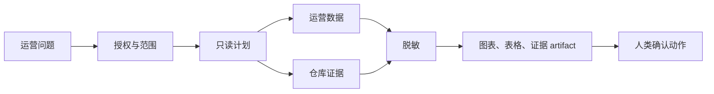

# 受治理的数据智能体，不是 SQL 聊天窗口

酒店运营问题很少只存在于一张报表里。

当某个供应商的 `hotelRates` 错误率突然升高，答案可能横跨 MySQL 订单记录、TDengine 请求日志、供应商专属代码路径，以及几个月前写下的运行手册。Dashboard 可以显示异常，但通常无法解释异常来自供应商行为变化、凭证问题、映射缺口，还是业务规则不匹配。

HotelByte Data Agent 正是为这个缺口设计的。

**TL;DR：** Data Agent 不是自然语言 SQL 控制台。它是一套受治理的运营调查层：把运营问题转成有边界的证据包，经过后端授权、只读查询意图、TDengine 和 MySQL 证据、仓库上下文、确定性脱敏、可视化 artifact，以及人类可确认的建议。

本文假设你熟悉运营分析、生产日志和基本数据访问治理。完整架构和控制模型请阅读白皮书：[面向运营智能的受治理数据智能体](/zh/whitepapers/wp26-data-agent-operational-intelligence/original/)。

## 从 Dashboard 到调查工作台

Data Agent 给平台运营人员提供的是一个会话式运营数据调查工作台。用户不需要从表名或日志查询开始，而是从问题开始：

> 过去 24 小时，哪个供应商的 hotelRates 错误率最高？请按请求量归一化。

一个有用的回答不应该只有文字。它应该展示：

- 查询意图和时间窗口。
- 涉及的数据源。
- 解释业务逻辑的代码或文档证据。
- 可视化结果形态。
- 简明解释。
- 需要人类确认的下一步建议。

这就是聊天机器人和运营调查助手的区别。

## 为什么仓库上下文重要

运营数据里很多字段的含义由代码定义。状态值、fallback 规则、供应商脱敏、重试路径或凭证策略，看起来可能很直观，但供应商集成经常存在例外。

Data Agent 的设计目标是同时搜索数据和业务逻辑。它把运行时证据连接到仓库与文档证据，让解释扎根于平台真实实现，而不是只根据图表做泛化猜测。

## 治理优先

第一版刻意限制为 platform-only。这个入口可能涉及跨租户数据、供应商遥测、商业字段、凭证和日志，因此必须有严格治理模型：

- 只有平台用户可以访问页面。
- 后端授权仍然是事实来源。
- 敏感数据默认脱敏。
- 查询生成必须只读且有来源边界。
- 建议是草稿，不会自动执行数据变更。
- 每次调查都应该可审计。

一个关键实现细节是：图表和表格不是样例数据。前端只渲染后端返回的 `data_ops_result` artifact。没有 artifact 就显示空态；数据源不可用就展示证据缺口。

## 运营人员得到什么

Data Agent 位于现有 Agent Workbench 的 `data-ops` profile。体验保留普通 run/message 工作流，并增加两个面向数据的结果视图：

- Messages：多轮调查、证据和建议轨迹。
- Visuals：让趋势、体量和脱敏影响可扫描的图表。
- Results：导出或后续操作前的结构化脱敏数据预览。

这让运营人员保持控制权。智能体加速调查，但人类仍然审查证据并决定运营动作。

## 完整白皮书

完整白皮书进一步展开 source adapter、sanitizer、artifact schema、fail-closed 行为和验证路径：

- [中文白皮书](/zh/whitepapers/wp26-data-agent-operational-intelligence/original/)
- [English whitepaper](/en/whitepapers/wp26-data-agent-operational-intelligence/original/)
